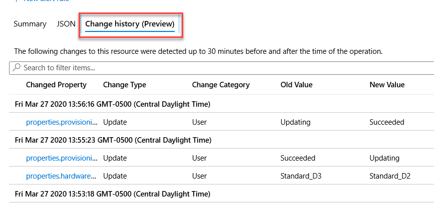
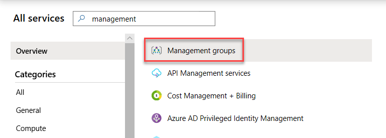
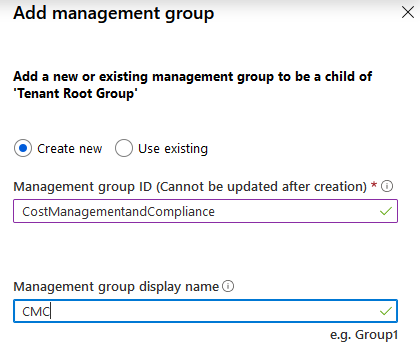
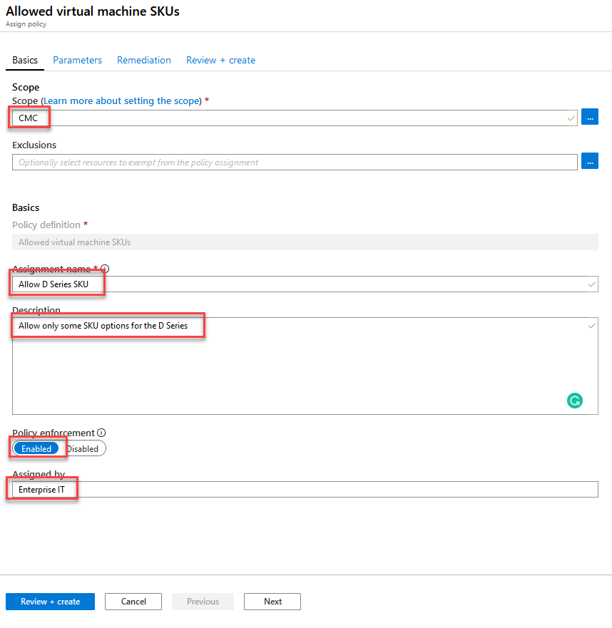
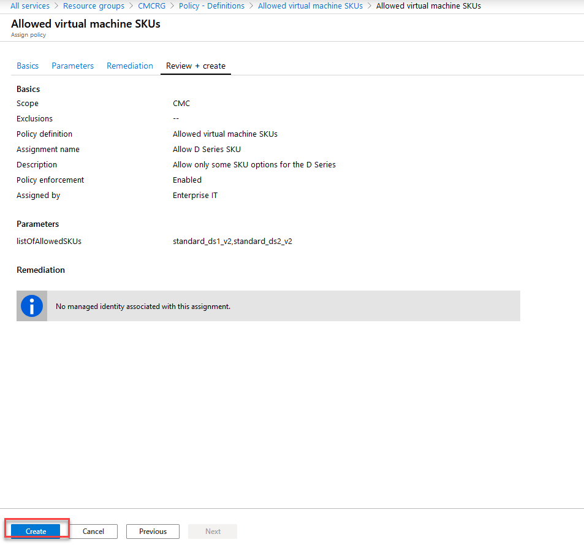
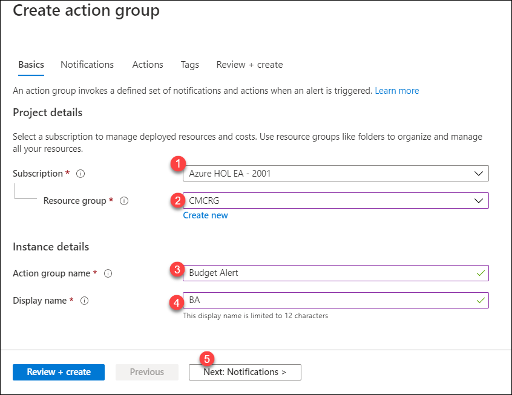
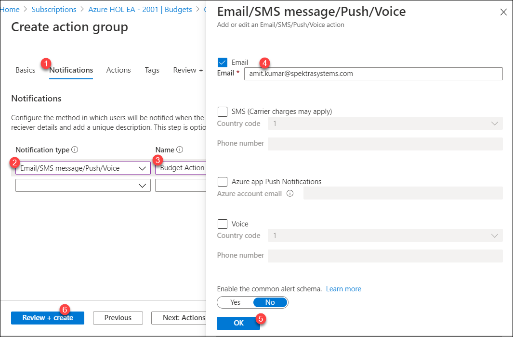
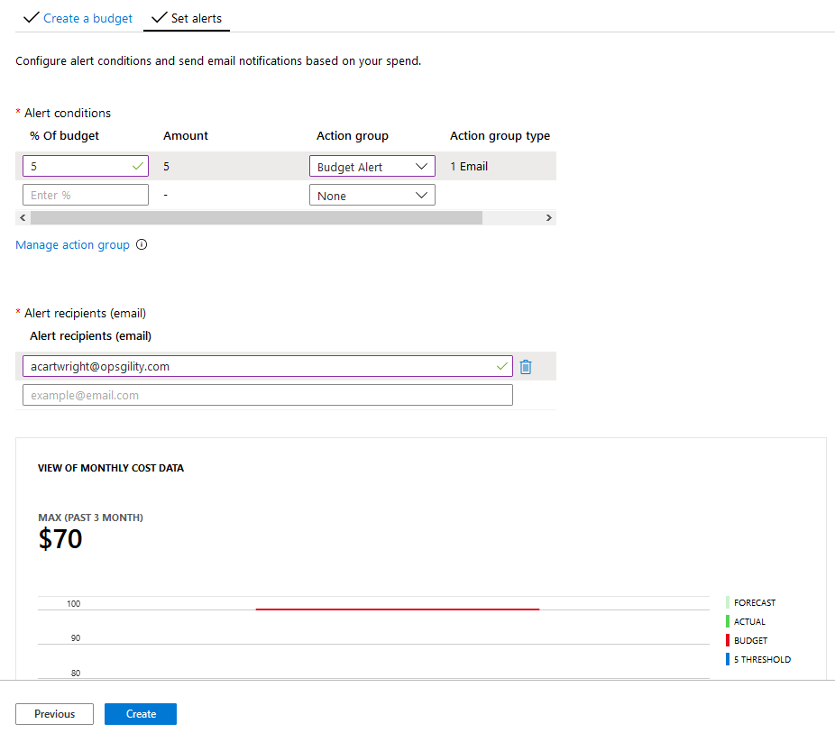

## Exercise 4: Monitoring Compliance and Cost

Duration: 20 minutes

In this exercise you will create an Azure Virtual Machine to use as a resource to monitor the compliance based on settings you will set. You will experience the Change History activity gaining visibility on when, who, how and if the resource was successful changed. You will create a Policy that will prevent further changes of the SKU for Virtual Machine. You will then review the Compliance details will of the policy allowing you to gain insight on operations against the resource on compliant and non-compliant resources. Last you will create a budget setting alerts to ensure that cost remain within the boundaries you have set.

### Task 1: Identifying Changes in Resources

In this task you will create the Virtual Machine resource that will be used for Monitoring and Cost Management.

1. From the portal launch the Azure Cloud Shell 

    
    
2. Execute the following script to create the resource group *CMCRG*.

    ```powershell
    New-AzResourceGroup -Name CMCRG -Location EastUS -Tag @{CostCenter="Finance"; IOCode="1000152"}
    ```

3. Execute the following script to build the Virtual Machine Resource:

   ```powershell
     New-AzVm `
        -ResourceGroupName "CMCRG" `
        -Name "VMCMC-vm" `
        -Location "East US" `
        -VirtualNetworkName "CMCVNet-vnet" `
        -SubnetName "CMC-SN" `
        -SecurityGroupName "CMCNSG" `
        -PublicIpAddressName "CMCPIP" `
        -OpenPorts 3389 `
        -Size Standard_DS1_v2
    ```
  
4. Enter the following information for the username and password:

   - Username: **demouser**
  
   - Password: **demo@pass123**

    

    > **Note**: It will take several minutes for the move to complete. Do not proceed to the next step until the script has completed.

5. From within the Azure Portal, navigate to the newly created Virtual Machine resource.

6. Select **Size** and change the virtual machine to **Standard DS2 v2**.

7. Repeat step 7 again this time selecting the **Standard DS1 v2** SKU to change it back to the default.

    > **Note**: This was done to generate activity for the log review later in the exercise. Also, this is to validate that the machine SKU can be changed without restriction.

8. From the VM page navigate to the **Activity Log** and select the Operation Name **Create or Update Virtual Machine**.

    

9. Next, select **Change History (Preview)** to review the changes that occurred on the resource.

    

### Task 2: Using Policies to Control SKUs

In this task you will create a management group and assign a policy that contains a list of allowed SKUs for the virtual machine resource created earlier.  

1. Launch the Azure Management Portal, and navigate to **Management Groups** under **All services**:

    

2. Select the **Add management group** option.

    

3. In the **Add management group** blade, enter **CostManagementandCompliance** as the management group ID and **CMC** as the display name. Select **Save**.

    

4. Select the **CMC** Management Group and then select the details link next to it.

5. Select the **+ Add Subscription** option and then choose your subscription.

6. Once your subscription is selected from the drop-down menu select the **Save** button to complete the configuration.

7. Navigate to **CMCRG** Resource Group and select **Policies** on the left.

    

8. Select **Definitions**.

9. On the **Definitions blade**, select **Category** and then from the drop-down **Compute** only.

10. Next, select **Allowed virtual machine SKUs**

    

11. In the **Allowed virtual machine SKUs** select the **Assign** option.

12. Next, select the ellipsis to configure the Scope. Select **CMC**, then select the **Select** button.

    

13. In the **Basics** form below, enter the following values:

    - Policy definition: **Leave the default**
  
    - Name: **Allow D Series SKU**

    - Description: **Allow only some SKU options for the D Series**
  
    - Policy enforcement: **Enabled**
  
    - Assigned by: **Enterprise IT**

    The assignment form should look like this:

    

14. Select the **Next** button.

15. On the Parameters blade from the Allowed SKUs menu select **Standard_DS1_v2** and **Standard_DS2_v2** from the allowed SKUs list. Select **Review + Create** to continue. On the Review + Create blade select **Create**.

    The assignment form should look like this:

    

    > **Note**: This was process can take up to 30 minutes to complete.

16. Navigate back to the CMCRG resource group and select **Policies**. Here you will see that the application of the policy has not started.

      

17. Once the policy has been applied, resize the virtual machine to another SKU not on the list. An option such as Standard_DS3_v2 can be used. You will see that policy has denied this request and it will be logged in the Azure Activity Log.

      

## Task 3: Create and Manage Azure Budgets

In this task you will create a Budget to ensure accountability within the organization.

1. From within the Azure portal navigate to **All Services**, select **General** and then **Subscriptions**.

    

2. Select your subscription and then select **Budgets** under the Cost Management menu.

3. Select the **+Add** option to start the creation of a budget.

4. Under the Budget Details enter the following information:

   - Name: **HRBudget**

   - Reset period: **Monthly**
  
   - Start date: **Leave defaults**
  
   - Expiration date: **2020 November 1**

5. Under the **Budget amount**, enter $100. Select **Next** when done.

6. On the **Set Alerts** blade, select the **Manage action group** option then **+ Add action group**.

7. In the Add action group **Basic** blade enter the following information and then click on **Next: Notifications** button.
    - Subscription: **Your Subscription**
    - Resource group: **CMCRG**
    - Action group name: **Budget Alert**  
    - Display name: **BA**
    
      
  
8. On **Notifications** blade, enter the following information and then click on **Review + create** and then **Create** and
    - Notification type: **Email/SMS message/Push/Voice**
    - Name: **Budget Action**
    
      
  
8. Select the close sign on the **Manage Actions** blade to return to the **Create Budget** blade.

9. Back on the **Set Alerts** blade, enter 5% for the budget and select **Budget Alert** from the **Action Group** options. Enter your email again and select the **Create** button.

    The assignment form should look like this:

    

10. You will receive an email validating that you have been added to the Azure Monitor Budget Alert Action Group. Additionally, you can return to the **Budgets** option under the Cost Management menu to review the newly created budget alert.

    

11. You will also receive an email later in the exercise regarding the Budget alert set earlier.

    
