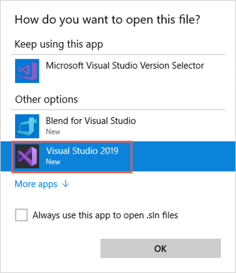
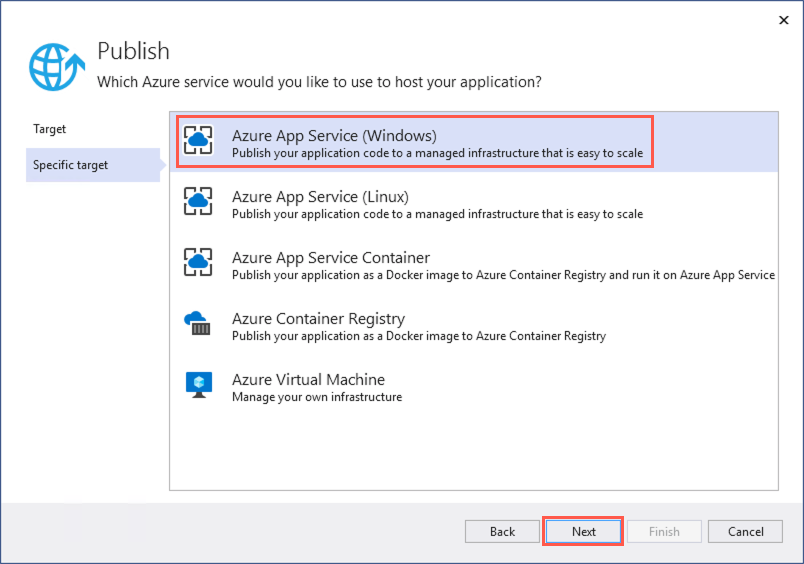

## Exercise 3: Update the web application to use the new SQL MI database

Duration: 30 minutes

With the `WideWorldImporters` database now running on SQL MI in Azure, the next step is to make the required modifications to the WideWorldImporters gamer information web application.

> **Note**
>
> Azure SQL Managed Instance has a private IP address in a dedicated VNet, so to connect an application, you must configure access to the VNet where Managed Instance is deployed. To learn more, read Connect your application to Azure SQL Managed Instance `https://docs.microsoft.com/azure/azure-sql/managed-instance/connect-application-instance`.

### Task 1: Deploy the web app to Azure

In this task, You will use JumpBox VM and then, using Visual Studio on the JumpBox, deploy the `WideWorldImporters` web application into the App Service in Azure.


 1. You have already logged-in to JumpBox VM, use this VM to continue with the lab. 

1. In the File Explorer dialog, navigate to the `C:\hands-on-lab` folder and then drill down to `Migrating-SQL-databases-to-Azure-master\Hands-on lab\lab-files`. In the `lab-files` folder, double-click `WideWorldImporters.sln` to open the solution in Visual Studio.

   

1. If prompted about how you want to open the file, select **Visual Studio 2019** and then select **OK**.

    

1. Select **Sign in** and enter your Azure account credentials when prompted using credentials given on lab details page.

    

1. At the security warning prompt, uncheck **Ask me for every project in this solution**, and then select **OK**.

    

1. Once logged into Visual Studio, right-click the `WideWorldImporters.Web` project in the Solution Explorer, and then select **Publish**.

    

1. On the **Publish** dialog, select **Azure** in the Target box and select **Next**.

    

1. Next, in the **Specific target** box, select **Azure App Service (Windows)**.

    

1. Finally, in the **App Service** box, select your subscription, expand the hands-on-lab-SUFFIX resource group, and select the `wwi-web-UNIQUEID` Web App.

    

1. Select **Finish**.

1. Back on the Visual Studio Publish page for the `WideWorldImporters.Web` project, select **Publish** to start the process of publishing your Web API to your Azure API App.

    

1. When the publish completes, you will see a message on the Visual Studio Output page that the publish succeeded.

    

2. If you select the link of the published web app from the Visual Studio output window, an error page is returned because the database connection strings have not been updated to point to the SQL MI database. You address this in the next task.

    

### Task 2: Update App Service configuration

In this task, you update the WWI gamer info web application to connect to and utilize the SQL MI database.

1. In the Azure portal `https://portal.azure.com`, select **Resource groups** from the Azure services list.

   

2. Select the hands-on-lab-SUFFIX resource group from the list.

   

3. In the list of resources for your resource group, select the **hands-on-lab-SUFFIX** resource group and then select the **wwi-web-UNIQUEID** App Service from the list of resources.

   

4. On the App Service blade, select **Configuration** under Settings on the left-hand side.

   

5. On the Configuration blade, locate the **Connection strings** section and then select the Pencil (Edit) icon to the right of the `WwiContext` connection string.

   

6. The value of the connection string should look like:

   ```sql
   Server=tcp:your-sqlmi-host-fqdn-value,1433;Database=WideWorldImportersSUFFIX;User ID=contosoadmin;Password=IAE5fAijit0w^rDM;Trusted_Connection=False;Encrypt=True;TrustServerCertificate=True;
   ```

7. In the Add/Edit connection string dialog, replace `your-sqlmi-host-fqdn-value` with the fully qualified domain name for your SQL MI that you copied to a text editor earlier from the Azure Cloud Shell and update the database SUFFIX with the SUFFIX value from Environment details page.

   

8. The updated value should look similar to the following screenshot.

   

9. Select **OK**.

10. Repeat steps 3 - 7, this time for the `WwiReadOnlyContext` connection string.

11. Select **Save** at the top of the Configuration blade.

    

12. When prompted that changes to application settings and connection strings will restart your application, select **Continue**.

    

13. Select **Overview** to the left of the Configuration blade to return to the overview blade of your App Service.

    

14. At this point, selecting the **URL** for the App Service on the Overview blade still results in an error being return. The error occurs because SQL Managed Instance has a private IP address in its VNet. To connect an application, you need to configure access to the VNet where Managed Instance is deployed, which you handle in the next exercise.

    
