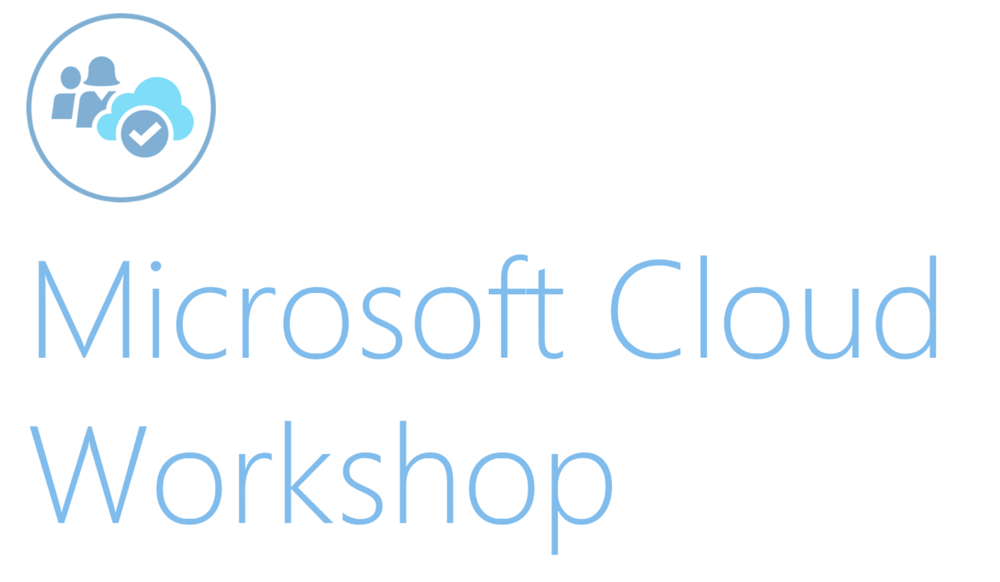

# Optimized architecture

## Hands-on lab unguided

## March 2018 

Information in this document, including URL and other Internet Web site references, is subject to change without notice. Unless otherwise noted, the example companies, organizations, products, domain names, e-mail addresses, logos, people, places, and events depicted herein are fictitious, and no association with any real company, organization, product, domain name, e-mail address, logo, person, place or event is intended or should be inferred. Complying with all applicable copyright laws is the responsibility of the user. Without limiting the rights under copyright, no part of this document may be reproduced, stored in or introduced into a retrieval system, or transmitted in any form or by any means (electronic, mechanical, photocopying, recording, or otherwise), or for any purpose, without the express written permission of Microsoft Corporation.

Microsoft may have patents, patent applications, trademarks, copyrights, or other intellectual property rights covering subject matter in this document. Except as expressly provided in any written license agreement from Microsoft, the furnishing of this document does not give you any license to these patents, trademarks, copyrights, or other intellectual property.

The names of manufacturers, products, or URLs are provided for informational purposes only and Microsoft makes no representations and warranties, either expressed, implied, or statutory, regarding these manufacturers or the use of the products with any Microsoft technologies. The inclusion of a manufacturer or product does not imply endorsement of Microsoft of the manufacturer or product. Links may be provided to third party sites. Such sites are not under the control of Microsoft and Microsoft is not responsible for the contents of any linked site or any link contained in a linked site, or any changes or updates to such sites. Microsoft is not responsible for webcasting or any other form of transmission received from any linked site. Microsoft is providing these links to you only as a convenience, and the inclusion of any link does not imply endorsement of Microsoft of the site or the products contained therein.
© 2018 Microsoft Corporation. All rights reserved.

Microsoft and the trademarks listed at https://www.microsoft.com/en-us/legal/intellectualproperty/Trademarks/Usage/General.aspx are trademarks of the Microsoft group of companies. All other trademarks are property of their respective owners.

## Contents

-   [Overview](#overview)
-   [Requirements](#requirements)
-   [Solution architecture](#solution-architecture)
-   [Before the hands-on lab](#before-the-hands-on-lab)
    -   [Task 1: Create a virtual machine for your lab environment](#task-1-create-a-virtual-machine-for-your-lab-environment)
    -   [Task 2: Disable IE Enhanced Security](#task-2-disable-ie-enhanced-security)
    -   [Task 3: Download the Sample App Files](#task-3-download-the-sample-app-files)
    -   [Task 4: Deploy Sample App and "Existing" Environment](#task-4-deploy-sample-app-and-existing-environment)
-   [Exercise 1: Determine Appropriate App Service Tiers and Estimate Cost Savings](#exercise-1-determine-appropriate-app-service-tiers-and-estimate-cost-savings)
    -   [Help references](#help-references)
    -   [Scenario](#scenario)
    -   [Task 1: Calculate Estimated Hosting Cost of Existing Solution](#task-1-calculate-estimated-hosting-cost-of-existing-solution)
    -   [Task 2: Calculate Estimated Hosting Cost of VMs with Reserved Instances](#task-2-calculate-estimated-hosting-cost-of-vms-with-reserved-instances)
    -   [Task 3: Estimate Necessary App Service Tiers](#task-3-estimate-necessary-app-service-tiers)
    -   [Task 4: Calculate Estimated Hosting Cost of Azure App Service](#task-4-calculate-estimated-hosting-cost-of-azure-app-service)
    -   [Task 5: Calculate Estimated Cost Savings](#task-5-calculate-estimated-cost-savings)
-   [Exercise 2: Integrate Traffic Manager](#exercise-2-integrate-traffic-manager)
    -   [Help references](#help-references-1)
    -   [Task 1: Create Traffic Manager](#task-1-create-traffic-manager)
    -   [Task 2: Point Traffic Manager to External / Internet Load Balancer](#task-2-point-traffic-manager-to-external-internet-load-balancer)
-   [Exercise 3: Setup API Tier in Azure App Service](#exercise-3-setup-api-tier-in-azure-app-service)
    -   [Task 1: Create App Service for Web API Tier](#task-1-create-app-service-for-web-api-tier)
    -   [Task 2: Setup App Settings](#task-2-setup-app-settings)
    -   [Task 3: Deploy API to App Service](#task-3-deploy-api-to-app-service)
-   [Exercise 4: Migrate Web App Tier to App Service](#exercise-4-migrate-web-app-tier-to-app-service)
    -   [Task 1: Create App Service for Web App Tier](#task-1-create-app-service-for-web-app-tier)
    -   [Task 2: Setup App Settings](#task-2-setup-app-settings-1)
    -   [Task 3: Deploy App to Web App](#task-3-deploy-app-to-web-app)
    -   [Task 4: Add Web App to Traffic Manager](#task-4-add-web-app-to-traffic-manager)
    -   [Task 5: Take down Web App and API VMs](#task-5-take-down-web-app-and-api-vms)
-   [Exercise 5: Migrate Background Tier to App Service](#exercise-5-migrate-background-tier-to-app-service)
    -   [Task 1: Create App Service for Background Tier](#task-1-create-app-service-for-background-tier)
    -   [Task 2: Setup App Settings](#task-2-setup-app-settings-2)
    -   [Task 3: Deploy App to App Service](#task-3-deploy-app-to-app-service)
    -   [Task 4: Take down Background Tier VM](#task-4-take-down-background-tier-vm)
-   [Exercise 6: Setup SQL Database Geo-Replication](#exercise-6-setup-sql-database-geo-replication)
    -   [Task 1: Setup SQL Database Geo-Replication](#task-1-setup-sql-database-geo-replication)
-   [Exercise 7: Take down old architecture / resources](#exercise-7-take-down-old-architecture-resources)
    -   [Task 1: Remove old VM-based tiers](#task-1-remove-old-vm-based-tiers)
-   [Exercise 8: Setup European Web App Tier Instance](#exercise-8-setup-european-web-app-tier-instance)
    -   [Task 1: Create European App Service](#task-1-create-european-app-service)
    -   [Task 2: Set App Settings](#task-2-set-app-settings)
    -   [Task 3: Deploy Web App to European Region](#task-3-deploy-web-app-to-european-region)
    -   [Task 4: Add European Region to Traffic Manager](#task-4-add-european-region-to-traffic-manager)
-   [After the hands-on lab ](#after-the-hands-on-lab)
    -   [Task 1: Delete Resources](#task-1-delete-resources)

## Optimized Architecture hands-on lab unguided

## Abstract and learning objectives 

In this workshop, students will learn how to optimize a lift and shift
style IaaS architecture in Azure to improve cost savings. Students will
also compare IaaS and PaaS hosting options to save cost even further
using Azure App Service. Additionally, students will learn to improve
resiliency and high availability through multi-region deployment.

Attendees will learn how to:

-   Optimize Azure IaaS for cost savings

-   Migrate an Azure IaaS optimized

-   Compare cost between Azure IaaS versus Azure PaaS

-   Setup SQL Database geo-replication

-   Configure multi-region deployment

## Overview

The Optimized Architecture hands-on lab (HOL) is a hands-on exercise
that will challenge you to calculate Azure spending optimizations by
comparing IaaS and PaaS services using a supplied sample application (a
3-tier application written in C\# and ASP.NET MVC) that is based on
Microsoft Azure IaaS services such as Virtual Machines, Virtual Network,
Load Balancers, Storage and SQL Database. In addition to calculating
estimated Azure cost of the existing architecture, you will need to
calculate the estimated cost of hosting the sample application using
Azure PaaS services. The scenario will include migrating the full sample
application to be hosted on Azure PaaS services such as Azure App
Service Web Apps, Web Jobs, and Traffic Manager as well as implementing
a secondary hosting region for the Web App tier and database
replication.

The HOL can be implemented on your own, but it is highly recommended to
pair up with other members at the HOL to model a real-world experience
much closer and to allow each member to share their expertise for the
overall solutions.

## Solution architecture

## Requirements

1.  Microsoft Azure subscription

2.  Local machine or a virtual machine configured with Visual Studio
    2017 Community Edition or better

## Before the hands-on lab

Duration: 20 minutes

In this exercise, you will set up an environment to use for the rest of
the exercises.

#### Task 1: Create a virtual machine for your lab environment 

1.  Launch a browser using incognito or in-private mode, and navigate to
    <https://portal.azure.com>. Once prompted, login with your Microsoft
    Azure credentials. If prompted, choose whether your account is an
    organization account or just a Microsoft Account.

2.  Click on **+ Create Resource**, and in the search box, type in Visual Studio
    Community 2017 on Windows Server 2016 (x64), and press enter. Click
    the Visual Studio Community 2017 image running on Windows Server
    2016 and with the latest update.

3.  In the returned search results, click the image name.

    > 

4.  In the Marketplace solution blade, click **Create**.

5.  Set the following configuration on the Basics tab, and click **OK**.

    -   Name: **LABVM**

    -   VM disk type: **SSD**

    -   User name: **demouser**

    -   Password: **demo@pass123**

    -   Subscription: **If you have multiple subscriptions choose the
        subscription to execute your labs in.**

    -   Resource Group: **OPSLABRG**

    -   Location: **Choose the closest Azure region to you.**

6.  Choose the **DS1\_V2 Standard** instance size on the Size blade.

7.  Accept the remaining default values on the Settings blade, and click
    **OK**. On the Summary page, click **OK**. The deployment should
    begin provisioning. It may take more than 10 minutes for the virtual
    machine to complete provisioning.

    

#### Task 2: Disable IE Enhanced Security

> Note: Sometimes this image has IE ESC disabled. Sometimes it does not.

1.  On the new VM, you just created click the **Server Manager** icon.

    

2.  Click **Local Server**.

    

3.  On the right side of the pane, click **On** by IE Enhanced Security
    Configuration.

    

4.  Change to **Off** for Administrators and click **OK**.

    

#### Task 3: Download the Sample App Files 

1.  Create a new folder on your C: drive named **HOL**.

2.  Download the sample application and ARM template
    (optimized-architecture-student.zip) from here:
    <https://cloudworkshop.blob.core.windows.net/optimized-architecture/OptimizedArchitecture-StudentFiles-6-2017.zip>.

3.  Right click on the downloaded .zip file and click **Properties**. On
    the properties pane check **Unblock** to ensure the files are marked
    safe.

4.  Extract the zip file contents to the **HOL** folder.

5.  From the **ARMTemplate** folder under **HOL**, open the Visual
    Studio Solution file: **Contoso.Financial.ARMTemplate.sln**.

#### Task 4: Deploy Sample App and "Existing" Environment

1.  From the *C:\\HOL\\ARMTemplate* folder, open the Visual Studio
    Solution: **Contoso.Financial.ARMTemplate.sln**

2.  In the **Solution Explorer** window, right-click on the
    **Contoso.Financial.ARMTemplate** project, click **Deploy**, and
    then click **New...**

    

3.  If your Microsoft or Organization account for your Azure
    Subscription has not been added to Visual Studio yet, click on **Add
    an account**, then **Add an account...**, and follow the prompts to
    login.
    
    

4.  Click on the **Resource group** dropdown, followed by selecting
    **\<Create New...\>.**

    

5.  On the **Create Resource Group** dialog, enter the following values:

    -   Resource group name: **ContosoExistingRG**

    -   Resource group location: **North Central US**
       
        

6.  Click the **Create** button.

7.  On the **Deploy to Resource Group** dialog, click the **Deploy**
    button to deploy the ARM Template to the newly created Resource
    Group.

    

8.  Deployment status of the ARM Template will be displayed in the
    **Output** window within Visual Studio.

    

9.  Once the deployment has completed successfully, the **IP Address**
    and **FQDN** of the External / Internet Load Balancer for the Web
    App tier will be displayed in the output window.

    

    > The **Username** and **Password** for the VMs and SQL Database created
    by the ARM Template are:
    > - Username: **demouser**
    > - Password: **demo@pass123** 

10. Open a new **Web Browser** window, and navigate to the Web App tier
    using the **Internet Load Balancer IP Address**.\
    \
    

11. To login to the Web App Tier of the Contoso Financial sample
    application, simply enter **any email address and password**,
    followed by clicking on **Sign in**.

12. Once logged in, the sample application will display a simple
    **Account Transaction** ledger.\
    \
    

    > Leaving the browser open to the Account Overview page will automatically
    load new transactions as they are generated by the background process,
    since the web page has a JavaScript timer that checks for new
    transactions periodically.
    You should follow all steps provided *before* attending the Hands-on lab

## Exercise 1: Determine Appropriate App Service Tiers and Estimate Cost Savings

Contoso Financial has asked you to optimize their Azure spending by
migrating their existing Azure IaaS based architecture over to Azure
PaaS services. You will need to determine the appropriate hosting tiers
and estimate the total cost savings on a monthly and annual basis.

#### Help references

|         |            |
| ------------- |:-------------:|
| Azure Pricing Calculator    | <https://azure.microsoft.com/en-us/pricing/calculator> |
| Virtual Machines Pricing    | <https://azure.microsoft.com/en-us/pricing/details/virtual-machines/>  |
| App Service Pricing | <https://azure.microsoft.com/en-us/pricing/details/app-service> |

#### Scenario

Contoso Financial recently performed a lift-and-shift to move their
application into Microsoft Azure using the North Central US region. As a
result, the existing architecture of the application is implemented with
Virtual Machines, Load Balancers, Availability Sets, SQL Database, and a
Virtual Network.

![The current scenario diagram for Contoso Financial has three users on
the internet passing through an external load balancer to access the
Availability Set (Web App) with two virtual machines. Both the first
availability set, and a second availability set (background processes)
pass through an internal load balancer to a third availability set (Web
API). A SQL Database shares bi-directional access with the Web API
availability set. All three availability sets are subnets of a VNet,
which is in the Azure North Central US
Region.](images/Hands-onlabunguided-Optimizedarchitectureimages/media/image18.png "Current scenario diagram")

You have also been provided with the following metrics showing the
average CPU / RAM utilization of the Virtual Machines hosting the
solution that are all on the Standard D3 pricing tier.

When calculating the pricing for the environment, there may be some
differences depending if you use the prices listed in the Azure Portal
or the Azure Pricing Calculator.

Additionally, the Azure SQL Database is hosted using the Premium P4
pricing tier.

The VM sizes from the Existing architecture that was deployed using the
ARM Template will be slightly different from the diagram above for this
scenario. The reason for this was to make the ARM Template deployment
quicker and cheaper while still deploying enough to allow you to perform
the exercises in this lab.

#### Task 1: Calculate Estimated Hosting Cost of Existing Solution

###### Tasks to complete

-   Calculate the estimated hosting cost of the existing architecture.

    -   Factor in the Virtual Machine instances and SQL Database of the
        Existing Architecture.

###### Exit criteria

-   Have an estimate of the total estimated Azure cost to hosting the
    sample application in the Existing Architecture.

#### Task 2: Calculate Estimated Hosting Cost of VMs with Reserved Instances

###### Tasks to complete

-   Calculate the estimated hosting cost of the existing architecture
    using Reserved Instances.

    -   Factor in the Virtual Machine instances and SQL Database of the
        Existing Architecture using Reserved Instances.

###### Exit criteria

-   Have an estimate of the total estimated Azure cost to hosting the
    sample application in the Existing Architecture using Reserved
    Instances.

#### Task 3: Estimate Necessary App Service Tiers

###### Tasks to complete

-   Estimate the necessary Azure App Service Plan for hosting the sample
    application in Azure PaaS services.

    -   Factor in the App Service Plans / instances and SQL Database.

###### Exit criteria

-   Determine the appropriate App Service Plan pricing tier necessary to
    host the application while maintaining the ability to handle
    existing application load.

#### Task 4: Calculate Estimated Hosting Cost of Azure App Service

###### Tasks to complete

-   Calculate the estimated hosting cost of the sample application using
    Azure App Service.

###### Exit criteria

-   Have an estimate of the total estimated Azure cost to hosting the
    sample application using Azure App Service.

#### Task 5: Calculate Estimated Cost Savings

###### Tasks to complete

-   Calculate the total estimated cost savings between the existing IaaS
    architecture and migrating to Azure App Service.

###### Exit criteria

-   Determine both the Monthly and Annual cost savings comparing the
    cost of both the Existing Architecture and the new Azure App Service
    architecture.

## Exercise 2: Integrate Traffic Manager

Contoso Financial needs new load balancing solutions implemented using
Azure Traffic Manager. The existing architecture uses a Load Balancer,
but that does not accommodate the growth of Contoso Financial
appropriately where they will need to add additional hosting regions in
Europe.

#### Help references

|         |            |
| ------------- |:-------------:|
| Azure Load Balancer    | <https://azure.microsoft.com/en-us/services/load-balancer/> |
| Azure Traffic Manager   | <https://azure.microsoft.com/en-us/services/virtual-network>  |

#### Task 1: Create Traffic Manager

###### Tasks to complete

-   Setup Traffic Manager to point to the Front-end Web App tier of the
    sample application.

###### Exit criteria

-   A Traffic Manager has been created in the Azure Subscription within
    the North Central US region.

#### Task 2: Point Traffic Manager to External / Internet Load Balancer

###### Tasks to complete

-   Configure the Traffic Manager to integrate with the External Load
    Balancer for the Front-end Web App tier.

###### Exit criteria

-   Have a Traffic Manager endpoint that can be used to access the
    Front-end Web App tier configured through the existing External Load
    Balancer.

## Exercise 3: Setup API Tier in Azure App Service

#### Help references

|         |            |
| ------------- |:-------------:|
| API Apps overview    | <https://docs.microsoft.com/en-us/azure/app-service-api/app-service-api-apps-why-best-platform> |
| Deploy an ASP.NET web app to Azure App Service, using Visual Studio  | <https://azure.microsoft.com/en-us/documentation/articles/web-sites-dotnet-get-started/>  |
| Configure web apps in Azure App Service  | <https://azure.microsoft.com/en-us/documentation/articles/web-sites-configure/>  |

#### Task 1: Create App Service for Web API Tier

###### Tasks to complete

-   Setup an App Service instance to use for hosting the Web API tier.

###### Exit criteria

-   An App Service instance has been created in the North Central US
    region.

#### Task 2: Setup App Settings

###### Tasks to complete

-   Setup the Application Settings to configure the Connection String
    named "TransactionDb" to contain the connection string for the
    sample applications SQL Database.

###### Exit criteria

-   The Application Settings Connection String has been configured.

#### Task 3: Deploy API to App Service

###### Tasks to complete

-   Deploy the API tier of the sample application (located within the
    Contoso.Financial.Api project within the Contoso.Financial Visual
    Studio solution in the HOL files) into the App Service Web App.

###### Exit criteria

-   The API tier has been deployed and is accessible.

## Exercise 4: Migrate Web App Tier to App Service

#### Help references

|         |            |
| ------------- |:-------------:|
| Azure Web Apps overview  | <https://docs.microsoft.com/en-us/azure/app-service-api/app-service-api-apps-why-best-platform> |
| Deploy an ASP.NET web app to Azure App Service, using Visual Studio  | <https://azure.microsoft.com/en-us/documentation/articles/web-sites-dotnet-get-started/>  |
| Configure web apps in Azure App Service  | <https://azure.microsoft.com/en-us/documentation/articles/web-sites-configure/>  |

#### Task 1: Create App Service for Web App Tier

###### Tasks to complete

-   Setup an App Service instance to use for hosting the Web App tier.

###### Exit criteria

-   An App Service instance has been created in the North Central US
    region.

#### Task 2: Setup App Settings

###### Tasks to complete

-   Setup the Application Settings to configure the App Setting named
    "transactionAPIUrl" to contain the URL to the API tier hosted in App
    Service.

###### Exit criteria

-   The Application Settings App Setting has been configured.

#### Task 3: Deploy App to Web App

###### Tasks to complete

-   Deploy the Web App tier of the sample application (located within
    the Contoso.Financial.Web project within the Contoso.Financial
    Visual Studio solution in the HOL files) into the App Service Web
    App.

###### Exit criteria

-   The Web App Tier has been deployed and is accessible in a web
    browser.

#### Task 4: Add Web App to Traffic Manager

###### Tasks to complete

-   Configure a Traffic Manager Endpoint for the new App Service hosted
    Web App Tier of the application.

-   Remove the External Load Balancer Endpoint from the Traffic Manager.

###### Exit criteria

-   The Traffic Manager Endpoint has been configured for the App Service
    Web App Tier, and it is accessible in a web browser.

-   The External Load Balancer Endpoint has been removed from Traffic
    Manager.

#### Task 5: Take down Web App and API VMs

###### Tasks to complete

-   Stop the Web App Tier Virtual Machines.

-   Stop the API tier Virtual Machines.

###### Exit criteria

-   The Virtual Machines hosting the Web App and API tiers of the sample
    application are in a "Stopped (deallocated)" state.

## Exercise 5: Migrate Background Tier to App Service

#### Help references

|         |            |
| ------------- |:-------------:|
| Using WebJobs in Azure App Service  | <https://azure.microsoft.com/en-us/documentation/articles/app-service-webjobs-readme/> |
| Run Background tasks with WebJobs  | <https://azure.microsoft.com/en-us/documentation/articles/web-sites-create-web-jobs/>  |
| Configure web apps in Azure App Service  | <https://azure.microsoft.com/en-us/documentation/articles/web-sites-configure/>  |

#### Task 1: Create App Service for Background Tier

###### Tasks to complete

-   Setup an App Service instance to use for hosting the Background tier

###### Exit criteria

-   An App Service instance has been created in the North Central US
    region.

#### Task 2: Setup App Settings

###### Tasks to complete

-   Setup the Application Settings to configure the Connection String
    named "TransactionDb" to contain the connection string to the SQL
    Database.

###### Exit criteria

-   The Application Settings Connection String has been configured.

#### Task 3: Deploy App to App Service

###### Tasks to complete

-   Deploy the Background tier of the sample application (located within
    the Contoso.Financial.Background project within the
    Contoso.Financial Visual Studio solution in the HOL files) into the
    App Service Web App as a Web Job.

-   Configure the Web Job to be recurring and scheduled to run every **1
    Minutes**.

###### Exit criteria

-   The Background tier has been deployed.

-   The Background tier is scheduled to run every 1 minute.

#### Task 4: Take down Background Tier VM

###### Tasks to complete

-   Stop the Background Tier Virtual Machine.

###### Exit criteria

-   The Virtual Machine hosting the Background tier of the sample
    application is in a "Stopped (deallocated)" state.

## Exercise 6: Setup SQL Database Geo-Replication

#### Help references

|         |            |
| ------------- |:-------------:|
| Introduction to SQL Database  | <https://azure.microsoft.com/en-us/documentation/articles/sql-database-technical-overview/> |
| SQL Database Active Geo-Replication  | <https://azure.microsoft.com/en-us/documentation/articles/sql-database-geo-replication-overview/>  |

#### Task 1: Setup SQL Database Geo-Replication

###### Tasks to complete

-   Configure the SQL Database with Active Geo-Replication.

###### Exit criteria

-   The SQL Database has been configured with Active Geo-Replication.

## Exercise 7: Take down old architecture / resources

#### Task 1: Remove old VM-based tiers

###### Tasks to complete

-   Remove all the Existing Architecture resources that are no longer
    being used after the migration to Azure PaaS services.

###### Exit criteria

-   The Azure resources for the Virtual Network and Virtual Machines of
    the Existing Architecture have been removed.

-   The SQL Database remains.

## Exercise 8: Setup European Web App Tier Instance

#### Help references

|         |            |
| ------------- |:-------------:|
| Azure Web Apps overview | <https://azure.microsoft.com/en-us/documentation/articles/app-service-web-overview/> |
| Deploy an ASP.NET web app to Azure App Service, using Visual Studio  | <https://azure.microsoft.com/en-us/documentation/articles/web-sites-dotnet-get-started/>  |
| Configure web apps in Azure App Service  | <https://azure.microsoft.com/en-us/documentation/articles/web-sites-configure/>  |

#### Task 1: Create European App Service

###### Tasks to complete

-   Setup an App Service instance to use for hosting the Web App tier in
    the Azure North Europe region.

###### Exit criteria

-   An App Service instance has been created in the North Europe region.

#### Task 2: Set App Settings

###### Tasks to complete

-   Setup the Application Settings to configure the App Setting named
    "transactionAPIUrl" to contain the URL to the API tier hosted in App
    Service.

###### Exit criteria

-   The Application Settings App Setting has been configured.

#### Task 3: Deploy Web App to European Region

###### Tasks to complete

-   Deploy the Web App tier of the sample application (located within
    the Contoso.Financial.Web project within the Contoso.Financial
    Visual Studio solution in the HOL files) into the App Service Web
    App.

###### Exit criteria

-   The Web App Tier has been deployed to the North Europe region and is
    accessible in a web browser.

#### Task 4: Add European Region to Traffic Manager

###### Tasks to complete

-   Configure a Traffic Manager Endpoint for the new App Service hosted
    Web App Tier of the application in the North Europe region.

######  Exit criteria

-   The Traffic Manager Endpoint has been configured for the App Service
    Web App Tier, and is accessible in a web browser.

-   The Traffic Manager Endpoint for the App Service Web App Tier in the
    North Central US region remains.

-   The App is accessible through the Traffic Manager
    endpoint.

## After the hands-on lab 

#### Task 1: Delete Resources

1.  Now that the HOL is complete, go ahead and delete all the Resource
    Groups that were created for this HOL. You will no longer need those
    resources and it will be beneficial to clean up your Azure
    Subscription.

You should follow all steps provided *after* attending the Hands-on lab.

