

Securing PaaS

Before the hands-on lab setup guide

December 2018

Information in this document, including URL and other Internet Web site references, is subject to change without notice. Unless otherwise noted, the example companies, organizations, products, domain names, e-mail addresses, logos, people, places, and events depicted herein are fictitious, and no association with any real company, organization, product, domain name, e-mail address, logo, person, place or event is intended or should be inferred. Complying with all applicable copyright laws is the responsibility of the user. Without limiting the rights under copyright, no part of this document may be reproduced, stored in or introduced into a retrieval system, or transmitted in any form or by any means (electronic, mechanical, photocopying, recording, or otherwise), or for any purpose, without the express written permission of Microsoft Corporation.

Microsoft may have patents, patent applications, trademarks, copyrights, or other intellectual property rights covering subject matter in this document. Except as expressly provided in any written license agreement from Microsoft, the furnishing of this document does not give you any license to these patents, trademarks, copyrights, or other intellectual property.

The names of manufacturers, products, or URLs are provided for informational purposes only and Microsoft makes no representations and warranties, either expressed, implied, or statutory, regarding these manufacturers or the use of the products with any Microsoft technologies. The inclusion of a manufacturer or product does not imply endorsement of Microsoft of the manufacturer or product. Links may be provided to third party sites. Such sites are not under the control of Microsoft and Microsoft is not responsible for the contents of any linked site or any link contained in a linked site, or any changes or updates to such sites. Microsoft is not responsible for webcasting or any other form of transmission received from any linked site. Microsoft is providing these links to you only as a convenience, and the inclusion of any link does not imply endorsement of Microsoft of the site or the products contained therein.

© 2018 Microsoft Corporation. All rights reserved.

Microsoft and the trademarks listed at <https://www.microsoft.com/en-us/legal/intellectualproperty/Trademarks/Usage/General.aspx> are trademarks of the Microsoft group of companies. All other trademarks are property of their respective owners.# Securing PaaS setup

**Contents**

<!-- TOC -->

- [Securing PaaS before the hands-on lab setup guide](#securing-paas-before-the-hands-on-lab-setup-guide)
    - [Requirements](#requirements)
    - [Before the hands-on lab](#before-the-hands-on-lab)
      - [Task 1: Download GitHub resources for Jump Machine](#task-1-download-github-resources-for-jump-machine)
      - [Task 2: Deploy resources to Azure](#task-2-deploy-resources-to-azure)
      - [Task 3: Download GitHub resources for Jump machine](#task-3-download-github-resources-for-jump-machine)
      - [Task 4: Install SQL Server Management Studio](#task-4-install-sql-server-management-studio)
      - [Task 5: Install Fiddler](#task-5-install-fiddler)
      - [Task 6: Install Power BI Desktop](#task-6-install-power-bi-desktop)

<!-- /TOC -->

# Securing PaaS before the hands-on lab setup guide 

## Requirements

1.  Microsoft Azure subscription must be pay-as-you-go or MSDN

    - Trial subscriptions will *not* work.
  
2.  A machine with the following software:

    -   Visual Studio 2017 Community edition or greater
    
    -   SQL Server Management Studio 2017
    
    -   Power BI Desktop
    
    -   Fiddler

**To ensure you can begin the course delivery on-time, you must take the following step at least 5-hours prior to the course start time:**

> **Note:** The Application Service Environment (ASE) and Web Application Firewall (WAF) can take more than 90-minutes to create depending on the load in the region.

## Before the hands-on lab

Duration: 30 minutes

Synopsis: In this exercise, you will set up your environment for use in the rest of the hands-on lab. You should follow all the steps provided in the Before the Hands-on Lab section to prepare your environment *before* attending the workshop.

### Task 1: Download GitHub resources for Jump machine

In this task, you will download the Azure Resource Manager (ARM) template required to setup this lab from a GitHub repository.

1.  Open a browser window to the cloud workshop GitHub repository (<https://github.com/Microsoft/mcw-securing-paas>).

2.  Select **Clone or download**, then select **Download Zip**.

    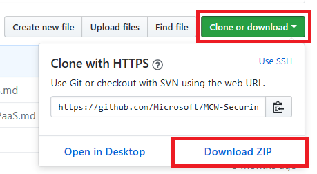

3.  Extract the zip file to your local machine, be sure to keep note of where you have extracted the files.

### Task 2: Deploy resources to Azure

In this task, you will run the ARM template downloaded in the previous task in the Azure portal to provision the resources you will be using throughout this hands-on lab.

1.  In a browser, open the [Azure Portal](https://portal.azure.com/).

    >**Note**: If prompted, select **Maybe Later**.

2.  Select **Resource groups** from the left-hand navigation menu, then select **+Add**.

    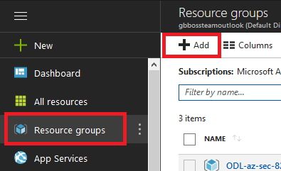

3.  Enter a **resource group** name, such as **paassecurity-\[your initials or first name\]**.

    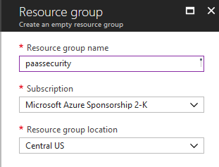

4.  Select **Create**.

5.  Select **Refresh** to see your new resource group displayed and select it.

6.  Select **Automation Script**.

    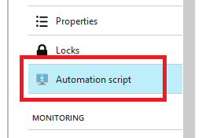

7.  Select **Deploy**.

    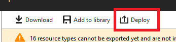

8.  Select **Build your own template in the editor**.

9.  In the extracted folder, open the **\\Hands-on lab\\AzureTemplate\\azure-deploy.json**.

10. Copy and paste it into the window.

11. Select **Save**, you will see the dialog with the input parameters. Fill out the form:

    -   **Subscription**: Select your subscription.

    -   **Resource group**: Use an existing Resource group or create a new one by entering a unique name, such as **paassecurity-\[your initials or first name\]**.

    -   **Location**: Select a location for the Resource group. Recommend using East US, East US 2, West Central US, or West US 2.

    -   Modify the **parameters** to be something unique by replacing with your initials or something similar.

    -   Fill in the remaining parameters, but if you change anything be sure to note it for future reference throughout the lab.

    -   **Be sure your resource group location matches the location you select in the settings window**.

    >**Note**: This field and matching is due to a limitation of the resource templates not resolving the resource group location for some template types.

    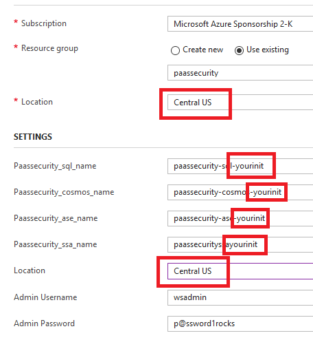

12. Check the **I agree to the terms and conditions stated above** checkbox.

13. Select **Purchase**.

    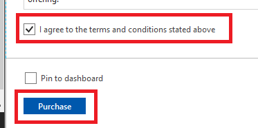

14. The deployment will take about 90 minutes to complete. To view the progress, select the **Deployments** link.

- As part of the deployment, you will see the following items created:

    - App Service Environment v2

    - Virtual Networks and Machines

    - Cosmos DB

    - Azure SQL Server and Databases

    - Application Gateway with Firewall

15. See Appendix A for detailed steps on creating these components without using an ARM template.

### Task 3: Download GitHub resources for Jump machine

In this task, you will log into the lab VM that was created by the ARM template you executed in the previous task and download the GitHub resources needed to complete this hands-on lab.

1.  Login to the paassecurity-vm-jump virtual machine.

    -   Select **Virtual machines**.

    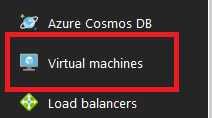

    -   Select **paassecurity-vm-jump**.

    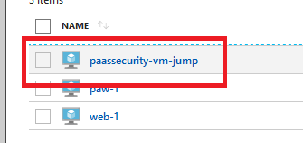

    -   Select **Connect**.
    
        >**Note**:  Ensure the status is **Running**.  It could take up to 10 minutes for the Virtual machine to provision.

    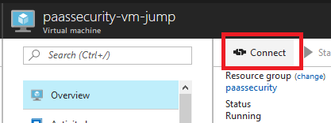

    -   Select to open the RDP connection.

    -   Enter the VM credentials (**wsadmin -- p\@ssword1rocks**).

    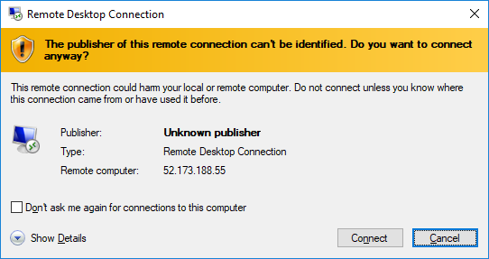
    
    -   Select **Connect**.

2.  Once logged in, launch the Server Manager. This should start automatically, but you can access it via the Start menu if it does not start.

3.  Select **Local Server**, if the **IE Enchanced Security Configuration** setting displays **On** then select **On**.

    

    -   In the Internet Explorer Enhanced Security Configuration dialog, select **Off** under Administrators, then select **OK**.

    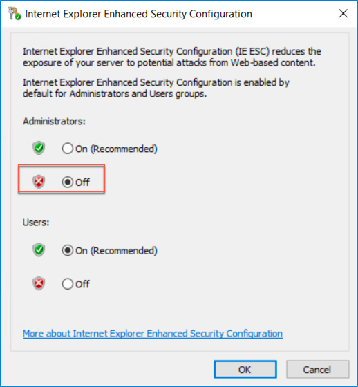

5.  Close the Server Manager.

6.  Repeat the steps you completed in [Task 1](#task-1-download-github-resources-jump-machine) to download or copy the GitHub folders to the virtual machine.

### Task 4: Install SQL Server Management Studio

In this task, you will install SQL Server Management Studio (SSMS) on your Jump machine VM.

1.  On your jump machine VM, open a web browser and navigate to <https://docs.microsoft.com/en-us/sql/ssms/download-sql-server-management-studio-ssms>.

2.  Select **Download SQL Server Management Studio 17.x**.

    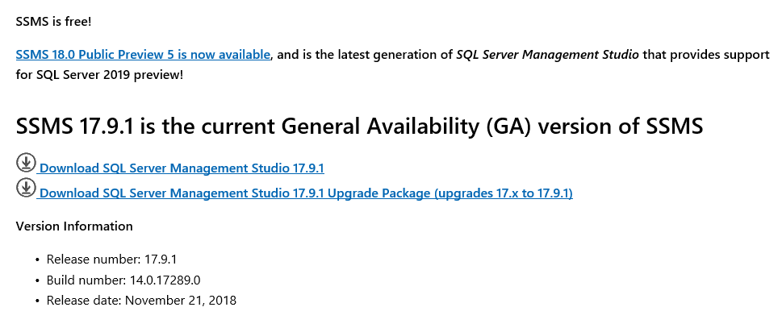

3.  Run the downloaded installer by clicking **Run** in the browser popup.

4.  On the Welcome screen, select **Install**.

   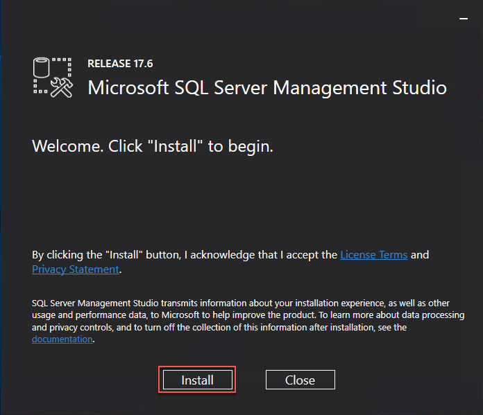

5.  **Close** the SSMS installer once setup is completed and **restart the VM** to complete the installation of SSMS.

### Task 5: Install Fiddler

In this task, you will download and install Fiddler, which will enable you to watch network traffic from your lab VM.

1.  In a web browser, navigate to <https://www.telerik.com/download/fiddler>.

2.  Complete the form, accepting the license agreement, and select Download for Windows.

  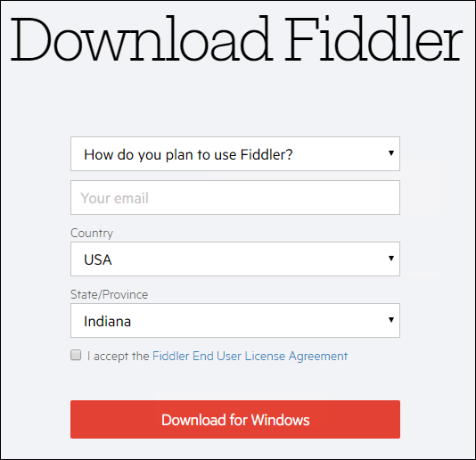

3.  Run the download installer, accepting all the default values.

4.  Close the installer when completed.

### Task 6: Install Power BI Desktop

Below, you will install Power BI on the jump VM, which will be used in Exercise 8.

1.  In a web browser on you jump VM navigate to the Power BI Desktop download page (<https://powerbi.microsoft.com/en-us/desktop/>).

2.  Select the **Advanced Download Options** link in the middle of the page.

  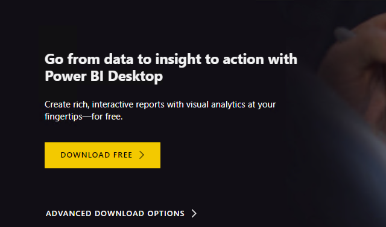

3.  Select the **Advanced Download Options** link in the middle of the page, then check the **Download** button.

4.  Select **PBIDesktop_x64.msi**, then click **Run** to start the installer.

5.  Select **Next** on the welcome screen.

  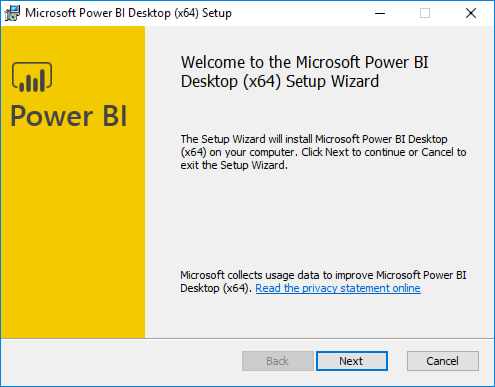

6.  Accept the license agreement, and select **Next**.

   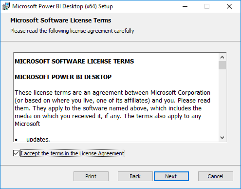

7.  Leave the default destination folder, and select **Next**.

  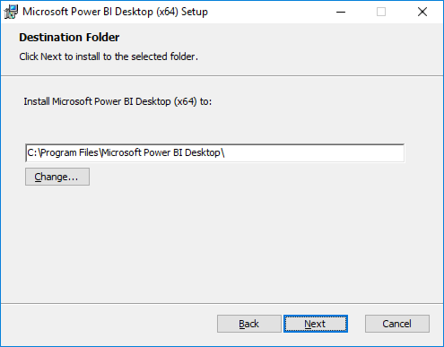

8.  Make sure the Create a desktop shortcut box is checked, and select **Install**.

   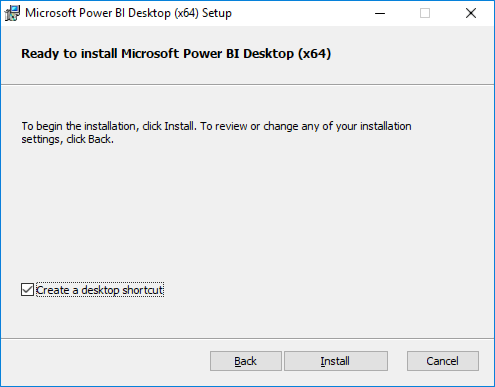

9.  Uncheck **Launch Microsoft Power BI Desktop**, and select **Finish**.

   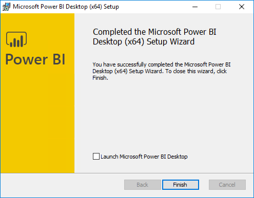

You should follow all steps provided *before* attending the Hands-on lab.
