<div class="MCWHeader1">
Securing PaaS
</div>

<div class="MCWHeader2">
Hands-on lab step-by-step
</div>

<div class="MCWHeader3">
December 2018
</div>

Information in this document, including URL and other Internet Web site references, is subject to change without notice. Unless otherwise noted, the example companies, organizations, products, domain names, e-mail addresses, logos, people, places, and events depicted herein are fictitious, and no association with any real company, organization, product, domain name, e-mail address, logo, person, place or event is intended or should be inferred. Complying with all applicable copyright laws is the responsibility of the user. Without limiting the rights under copyright, no part of this document may be reproduced, stored in or introduced into a retrieval system, or transmitted in any form or by any means (electronic, mechanical, photocopying, recording, or otherwise), or for any purpose, without the express written permission of Microsoft Corporation.

Microsoft may have patents, patent applications, trademarks, copyrights, or other intellectual property rights covering subject matter in this document. Except as expressly provided in any written license agreement from Microsoft, the furnishing of this document does not give you any license to these patents, trademarks, copyrights, or other intellectual property.

The names of manufacturers, products, or URLs are provided for informational purposes only, and Microsoft makes no representations and warranties, either expressed, implied, or statutory, regarding these manufacturers or the use of the products with any Microsoft technologies. The inclusion of a manufacturer or product does not imply endorsement of Microsoft of the manufacturer or product. Links may be provided to third-party sites. Such sites are not under the control of Microsoft and Microsoft is not responsible for the contents of any linked site or any link contained in a linked site, or any changes or updates to such sites. Microsoft is not responsible for webcasting or any other form of transmission received from any linked site. Microsoft is providing these links to you only as a convenience, and the inclusion of any link does not imply endorsement of Microsoft of the site or the products contained therein.

© 2018 Microsoft Corporation. All rights reserved.

Microsoft and the trademarks listed at <https://www.microsoft.com/en-us/legal/intellectualproperty/Trademarks/Usage/General.aspx> are trademarks of the Microsoft group of companies. All other trademarks are the property of their respective owners.

**Contents**

<!-- TOC -->

- [Securing PaaS hands-on lab step-by-step](#securing-paas-hands-on-lab-step-by-step)
    - [Abstract and learning objectives](#abstract-and-learning-objectives)
    - [Overview](#overview)
    - [Solution architecture](#solution-architecture)
    - [Requirements](#requirements)
    - [Exercise 1: Creating and securing Azure Active Directory accounts](#exercise-1-creating-and-securing-azure-active-directory-accounts)
        - [Task 1: Create Azure Active Directory groups](#task-1-create-azure-active-directory-groups)
        - [Task 2: Create Azure Active Directory accounts](#task-2-create-azure-active-directory-accounts)
        - [Task 3: Enable Azure Identity Protection features](#task-3-enable-azure-identity-protection-features)
    - [Exercise 2: Securing Azure Key Vault with Azure IAM](#exercise-2-securing-azure-key-vault-with-azure-iam)
        - [Task 1: Create a new Azure Key Vault](#task-1-create-a-new-azure-key-vault)
        - [Task 2: Assign IAM based Azure Key Vault permissions](#task-2-assign-iam-based-azure-key-vault-permissions)
        - [Task 3: Assign access policy based Azure Key Vault permissions](#task-3-assign-access-policy-based-azure-key-vault-permissions)
        - [Task 4: Verify Azure Key Vault permissions](#task-4-verify-azure-key-vault-permissions)
    - [Exercise 3: Azure deployments using Azure Key Vault](#exercise-3-azure-deployments-using-azure-key-vault)
        - [Task 1: Create new secrets](#task-1-create-new-secrets)
        - [Task 2: Deploy an ARM template using Azure Key Vault resources](#task-2-deploy-an-arm-template-using-azure-key-vault-resources)
    - [Exercise 4: Securing the web application and database](#exercise-4-securing-the-web-application-and-database)
        - [Task 1: Setup the database](#task-1-setup-the-database)
        - [Task 2: Test the web application solution](#task-2-test-the-web-application-solution)
        - [Task 3: Utilize data masking](#task-3-utilize-data-masking)
        - [Task 4: Utilize column encryption with Azure Key Vault](#task-4-utilize-column-encryption-with-azure-key-vault)
        - [Task 5: Enable Azure SQL Auditing & Threat Detection](#task-5-enable-azure-sql-auditing--threat-detection)
        - [Task 6: Ensure SQL Azure Transparent Data Encryption (TDE) is enabled](#task-6-ensure-sql-azure-transparent-data-encryption-tde-is-enabled)
    - [Exercise 5: Migrating web.config settings to Azure Key Vault](#exercise-5-migrating-webconfig-settings-to-azure-key-vault)
        - [Task 1: Create an Azure Key Vault secret](#task-1-create-an-azure-key-vault-secret)
        - [Task 2: Create an Azure Active Directory application](#task-2-create-an-azure-active-directory-application)
        - [Task 3: Assign the new Application Azure Key Vault permissions](#task-3-assign-the-new-application-azure-key-vault-permissions)
        - [Task 4: Install NuGet packages](#task-4-install-nuget-packages)
        - [Task 5: Test the solution](#task-5-test-the-solution)
    - [Exercise 6: Securing PaaS web applications with App Service Environment and Web Application Firewall](#exercise-6-securing-paas-web-applications-with-app-service-environment-and-web-application-firewall)
        - [Task 1: Deploy web application to App Service Environment](#task-1-deploy-web-application-to-app-service-environment)
        - [Task 2: Configure the Web Application Firewall](#task-2-configure-the-web-application-firewall)
        - [Task 3: Enable Application Gateway logging](#task-3-enable-application-gateway-logging)
        - [Task 4: Attack a ASE Web Application with Detection Only](#task-4-attack-a-ase-web-application-with-detection-only)
        - [Task 5: Enable Web Application Firewall Prevention](#task-5-enable-web-application-firewall-prevention)
        - [Task 6: Reattack an ASE Web Application with Prevention enabled](#task-6-reattack-an-ase-web-application-with-prevention-enabled)
    - [Exercise 7: Securing Azure Functions with Managed Service Identities](#exercise-7-securing-azure-functions-with-managed-service-identities)
        - [Task 1: Create an Azure Function](#task-1-create-an-azure-function)
        - [Task 2: Create a Managed Service Identity](#task-2-create-a-managed-service-identity)
        - [Task 3: Assign Managed Service Identity Azure Key Vault permissions](#task-3-assign-managed-service-identity-azure-key-vault-permissions)
        - [Task 4: Test your Azure Function](#task-4-test-your-azure-function)
    - [Exercise 8: Creating PaaS Audit and Compliance Power BI Reports](#exercise-8-creating-paas-audit-and-compliance-power-bi-reports)
        - [Task 1: Export a Power Query formula from Log Analytics](#task-1-export-a-power-query-formula-from-log-analytics)
    - [After the hands-on lab](#after-the-hands-on-lab)
        - [Task 1: Delete resource group](#task-1-delete-resource-group)
        - [Task 2: Delete Azure AD objects](#task-2-delete-azure-ad-objects)
        - [Task 3: Delete lab environment (optional)](#task-3-delete-lab-environment-optional)

<!-- /TOC -->

# Securing PaaS hands-on lab step-by-step 

## Abstract and learning objectives 

In this hands-on-lab, you will design an end-to-end PaaS solution that combines many of Azure's security features, while protecting sensitive data from both internal and external users.

At the end of this hands-on lab, you will be better able to develop a secure solution that takes advantage of the security features provided by an App Service Environment (ASE). You will know how to use an Azure DevOps machine and Visual Studio to deploy to the ASE after creating an app service plan. You will know how to enable a Web Application Firewall to filter requests based on the OWASP 3.0 standard and see that those requests are in fact blocked. In addition, you will know how Azure Identity Access and Management (Azure IAM) works and how those access permissions are separate from policies that may live within the actual Azure resource (such as with Azure Key Vault). You will learn how to remove sensitive information from your various resources such as Azure Functions and Web Applications and place them in the Azure Key Vault for both deployment and runtime use. As a final step, you will learn how to perform queries against Log Analytics to populate a Power BI report based on your Web Application Firewall events.

## Overview

In this hands-on lab, attendees will implement several of the PaaS security features of Azure to help ensure a secure application environment.

## Solution architecture

Below is a diagram of the solution architecture you will build in this lab. Please study this carefully, so you understand the whole of the solution as you are working on the various components.


The solution begins with a deployed template of typical and not so typical resources. Due to time restraints during deployment you will have an internal (versus an external facing) **App Service Environment** (ASE). The ASE will have no app service plans or apps deployed to it. It is also not accessible from the outside world. You will configure an application to be deployed using the **Azure DevOps** machine and Visual Studio to deploy to the ASE after creating an app service plan. Once deployed, you will then configure the **Application Gateway** to point to the new ASE hosted App. Once configured, you will perform a typical web-based attack on the environment in a detection-only mode to see the requests pass to your web application. Once you understand how this process works, you will then enable the **Web Application Firewall** to filter requests based on the **OWASP 3.0** standard and see that those requests are in fact blocked.

Separately, you will explore how Azure Identity Access and Management (Azure IAM) works and how those access permissions are separate from policies that may live within the actual Azure resource (such as with **Azure Key Vault**). You will learn how to remove sensitive information from your various resources such as **Azure Functions** and **Web Applications** and place them in the **Azure Key Vault** for both deployment and runtime use.

As a final step, you will learn how to perform queries against **Log Analytics** to populate a **Power BI** report based on your **Web Application Firewall** events.


## Requirements

1.  Microsoft Azure subscription must be pay-as-you-go or MSDN

    - Trial subscriptions will *not* work.
  
2.  A machine with the following software:

    -   Visual Studio 2017 Community edition or greater
    
    -   SQL Server Management Studio 2017
    
    -   Power BI Desktop
    
    -   Fiddler

**To ensure you can begin the course delivery on-time, you must take the following step at least 5-hours prior to the course start time:**

> **Note:** The Application Service Environment (ASE) and Web Application Firewall (WAF) can take more than 90-minutes to create depending on the load in the region.

## Exercise 1: Creating and securing Azure Active Directory accounts

Duration: 45 minutes

Synopsis: In this exercise, attendees will learn how to create Azure Active Directory (Azure AD) groups and users and then securing them using multi-factor authentication.

>**Note**: If you are using a corporate Azure instance and do not have access to Active Directory, you will not be able to complete this exercise, and should skip to [Exercise 3](#exercise-3-azure-deployments-using-azure-key-vault).

### Task 1: Create Azure Active Directory groups

In this task, you will create security groups in Azure AD to be used in exercises later in this hands-on lab.

1.  Open your Azure Portal (<https://portal.azure.com>).

2.  Select **Azure Active Directory**.

    

3.  Select **Groups,** then select **All groups**.

   

4.  Select **+New group**.

    

5.  On the Group blade, enter the following:

    a.  **Group type**: Select **Security**.

    b.  **Group name**: Enter **Key Vault Mgmt Admins**.

    c.  **Group description**: Enter **Key Vault Mgmt Admins**.

    d.  **Membership type**: Select **Assigned**.
    
    

6.  Select **Create** and close the dialog window if it does not close.

7.  Select **+New group** again.

8.  On the Group blade, enter the following:

    a.  **Group type**: Select **Security**.

    b.  **Group name**: Enter **Key Vault Key Admins**.

    c.  **Group description**: Enter **Key Vault Key Admins**.

    d.  **Membership type**: Select **Assigned**.
    
    

9.  Select **Create** and close the dialog window if it does not close.

### Task 2: Create Azure Active Directory accounts

In this task, you will create multiple Azure AD user accounts that will be used within the exercises in this hands-on lab to demonstrate the various levels of permissions and access control with Azure resources.

1.  Determine your Active Directory domain name.

    a.  Select **Azure Active Directory**.

    b.  Select **Custom domain names**.

    c.  Record the **\*.microsoftonline.com** domain name, as you will use this later.

2.  Select **Users**, then select **All users**.

   

3.  Select **+New user**.

4.  On the User blade, enter the following:

    a.  **Name**: Enter **Key Vault Admin**.

    b.  **User name**: Enter [KeyVaultAdmin@\<yourdomain\>.microsoftonline.com](mailto:KeyVaultAdmin@%3cyourdomain%3e.microsoftonline.com).

    >**Note**: Use the domain you recorded earlier.

    c.  Select **Groups**.

    d. Select **Key Vault Mgmt Admins**, click **Select**.

    e.  Check the **Show Password** check box and copy the password to Notepad.

    f.  Select **Create**.

5.  Select **+New user** again.

6.  On the User blade, enter the following:

    a.  **Name**: Enter **Key Vault Auditor**.

    b.  **User name**: Enter [KeyVaultAuditor@\<yourdomain\>.microsoftonline.com](mailto:KeyVaultAuditor@%3cyourdomain%3e.microsoftonline.com).

    >**Note**: Use the domain you recorded earlier.

    c.  Select **Groups**.

    d.  Select **Key Vault Mgmt Admins**, click **Select**.

    e.  Check the **Show Password** check box and copy the password to Notepad.

    f.  Select **Create**.

7.  Select **+New user** again.

    a.  **Name**: Enter **Key Vault Developer**.

    b.  **User name**: Enter [KeyVaultDeveloper@\<yourdomain\>.microsoftonline.com](mailto:KeyVaultDeveloper@%3cyourdomain%3e.microsoftonline.com).

    >**Note**: Use the domain you recorded earlier.

    >**Note**: No groups will be assigned to this user.

    c.  Check the **Show Password** check box and copy the password to Notepad.

    d.  Select **Create**.

### Task 3: Enable Azure Identity Protection features 

In this task, you will enable multi-factor authentication on the Key Vault Admin account you created in the previous task to demonstrate the Identity Protection features of Azure.

1.  In the Azure Portal, find and select your Azure Active Directory resource.

2.  Select **MFA**.

    

3.  Select **Get Free Premium Trial**.

4.  Select the **AZURE AD PREMIUM P2** option, select **Free trial**.

  

5.  Select **Activate**.

>**Note**:  A trial can only be activated once per Azure subscription tenant.  If you have already done a trial, you would need to buy a P2 license to utilize MFA in this lab.

6.  Select **Users**, the select **All users**.

  

7.  Select **Multi-Factor Authentication**.

    

8.  Check the check box for the **Key Vault Admin** user.

    

9.  Select **Enable**.

    

10. In the dialog, select **enable multi-factor auth**.

    

11. In the dialog, select **close**.

12. Attempt to sign-in as the **KeyVaultAdmin user**.

>**Note**:  If you did not record the password earlier, you will need to reset the password

   a. In the Azure portal, select Azure Active Directory.

   b.  Select Users, All Users, and select the **Key Vault Admin** user from the list.

   c.  On the Key Vault Admin user blade, select **Reset Password**.
    
   

   d.  On the Reset password blade, select **Reset password**.
    
   

   e.  Copy the Temporary password for use in the next step.
    
   

14. Open an InPrivate or Incognito browser window, navigate to <http://login.microsoftonline.com> and enter the **username** and **password** for the KeyVaultAdmin account.

15. You will be prompted to setup additional security, select **next**.

    

16. For **How should we contact you?**, select **Mobile app**.

    

17. Select **Use verification code**.

    

18. Select **Set up**.

19. Depending on your mobile device, download the Microsoft Authenticator application from the respective app store.

20. Scan the image on the page to add the credentials to your authenticator app.

    

21. Select **Next**, the page will validate that you in fact added the account.

    

22. Select **Next**, enter the **validation code** from the mobile app.

    

23. Select **Verify**.

24. On the Additional security verification, select your country, and enter your mobile phone number, then select **Next**.

    

25. On the next screen, copy the password provided, and select **Done**.

    

26. Enter the Authenticator app code on the next screen and select **Verify**.

    

27. If prompted, on the **Update your password page**, update your password.

    >**Note**: The Current password will be the value you copied after resetting the password in Azure AD.

28. Select **Sign in**.

29. If prompted, close the **Welcome to Microsoft Azure** dialog.

## Exercise 2: Securing Azure Key Vault with Azure IAM

Duration: 45 minutes

Synopsis: In this exercise, attendees will learn how to create various roles for managing the Azure Key Vault.

>**Note**: If you are using a corporate Azure instance and do not have access to administrative access to Active Directory, you must skip this Exercise and move to Exercise 3.  You can ask your administrations to setup [Azure administrative units](https://docs.microsoft.com/en-us/azure/active-directory/users-groups-roles/directory-administrative-units) to support this workshop.

### Task 1: Create a new Azure Key Vault

In this task, you will create a new Azure Key Vault.

1.  In your InPrivate or Incognito browser window, log into the Azure portal using the **KeyVaultAdmin** account.

2.  Click **Create a resource**, perform a search for **key vault**, then select **Key Vault**

    

3.  In the Key Vault resource summary blade, select **Create**.

4.  You should get a message that you must have admin access to create a key vault.

    

5.  Return to the Azure portal browser window where you are logged in with your subscription admin account, ensure it is not the Incognito window where the Key Vault Admin account is logged in.

6.  As in step 2 above, search for **Key vaults** and navigate to the Key Vault blade.

7.  Select **Create**.

    

8.  On the Create key vault blade, enter the following:

    a.  **Name**: Enter something similar to **paassecuritykeyvault\[Your Initials\]**.

    b.  **Subscription**: Select the subscription you are using for this lab.

    c.  **Resource group**: Select your existing resource group.

    d.  Leave Pricing tier and Access policies set to their default values.
    
    

9.  Select **Create**.

### Task 2: Assign IAM based Azure Key Vault permissions

In this task, you use Access control (IAM) to assign role-based access control (RBAC) permissions to the key vault you created in the previous task.

1.  When the Key vault has finished provisioning, you will receive a notification in the Azure portal. In the notification, select **Go to resource**.

    

2.  Select **Access control (IAM)**.

    

3.  Select **+Add role assignment**.

    

4.  In the Add permissions blade, enter:

    a.  **Role:** Select **Key Vault Contributor**.

    b.  **Assign access to**: Leave set to **Azure AD user, group, or service principal**.

    c. In the **Select** textbox, search for and select the **KeyVaultAdmin** user.
  
    

5.  Select **Save**.

6.  Select **+Add role assignment** again.

7.  In the Add permissions blade, enter:

    a.  **Role:** Select **Reader**.

    b.  **Assign access to**: Leave set to **Azure AD user, group, or service principal**.

    c.  **Select**: Search for and select the **KeyVaultAuditor** user.
  
    

8.  Select **Save**.

### Task 3: Assign access policy based Azure Key Vault permissions

In this task, you will add Access policies to the Azure Key Vault, to set the permissions of individual users within the key vault.

1.  On the new key vault blade, under **Settings**, select **Access Policies** from the left-hand menu.

    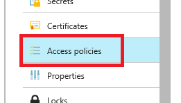

2.  Select **Click to show advanced access policies**.

    

3.  Check the boxes for all items.

    

4.  Select **Save**.

5.  Select **+ Add new**.

6.  On the Add access policy blade, enter the following:

    a.  Select **Select principal**

    - Search for and select **Key Vault Auditor**.
    - Select **Select**.

    b.  **Key permissions**: Check **List**.

    c.  **Secret permissions**: Check **List**.

    d.  **Certificate permissions**: Check **List**.
    
    

7.  Select **OK**.

8.  Select **Save**.

### Task 4: Verify Azure Key Vault permissions

In this task, you will log in with the three different Azure AD user accounts you created previously and observe the impact of the IAM and Access policy permissions you set above.

1.  Return to your InPrivate or Incognito browser window, and login as the **KeyVaultAdmin**.

2.  Search for and select **Key vaults**.

3.  You should now see the key vault displayed, select it.

4.  Select **Keys**, you should get a warning that the **List** operation is not assigned.

    >**Note**: IAM permissions are different than Azure Key Vault access policies.

    

5.  Select **Access policies**, then select **+Add new**.

    

6.  On the Add access policy blade, enter the following:

    a.  Select **Select principal**.

    -  Search for and select **Key Vault Admin**.
    -  Select **Select**.

    b.  For the **Key permissions**, check **Select all**.

    c.  For the **Secret permissions**, check **Select all**.

    d.  For the **Certificate permissions**, check **Select all**.
    
    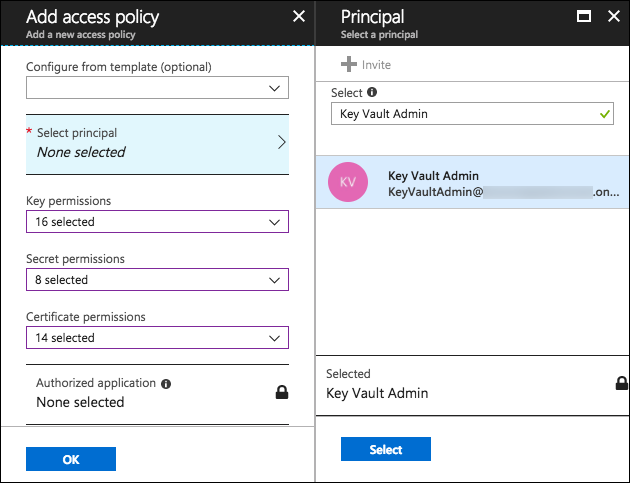

7.  Select **OK**.

8.  Select **Save**.

9.  Select **Keys** again from the left-hand menu, and you should now see the error disappear.

10. In your InPrivate or Incognito browser window, logoff and login as the **KeyVaultDeveloper**.

    >**Note**: If you did not record the password, you will need to reset the password for the account, as you did in [Exercise 1, Task 3, Step 13](#task-3-enable-azure-identity-protection-features).

    - Update the password, when prompted.

11. Search for and select **Key vaults**.

12. You should not be able to see the key vault displayed.

13. Log out.

14. Login as the **KeyVaultAuditor**.
    
    >**Note**: You will need to reset the password for the account, as you did in [Exercise 1, Task 3, Step 13](#task-3-enable-azure-identity-protection-features).

    -  Update the password, when prompted.

15. Search for and select **Key vaults**.

16. You should be able to see the key vault displayed, select it.

17. Select **Keys**, you should not get a warning.

18. Select **Access policies**.

19. Select **+Add new**.

20. Select **Select principal**.

    -   Search for and select **Key Vault Developer**.

    -   Select **Select**.

21. Notice the permission drop downs are greyed out! The Key Vault Auditor only has read permission therefore they cannot assign permissions to any other resources: 

    

22. Exit the Add access policy blade, discarding any changes.

## Exercise 3: Azure deployments using Azure Key Vault

Duration: 45 minutes

Synopsis: In this exercise, attendees will utilize the Microsoft.Compute deployment access that was given in the previous exercise to gain access to an Azure Key Vault secret and certificate without saving them in the template(s).

### Task 1: Create new secrets

In this task, you will add two secrets to the key vault.

1.  In your Incognito browser window, login as the **KeyVaultAdmin**.

2.  Select **Key vaults**.

3.  Select your key vault.

4.  Select **Secrets**.

5.  Select **+Generate/Import**.

    

6.  On the Create a secret blade, enter the following:

    a.  **Upload options**: Select **Manual**.

    b.  **Name**: Enter **SQLUsername**.

    c.  **Value**: Enter **AzureKVAdmin**.
    
    

7.  Select **Create**.

8.  Select **+Generate/Import** again.

9.  On the Create a secret blade, enter the following:

    a.  **Upload options**: Select **Manual**.

    b.  **Name**: Enter **SQLPassword**.

    c.  **Value**: Enter **DevsC\@ntSeeThis**.
    
    

10. Select **Create**.

11. You should now see two secrets in your Azure Key Vault: 

    

### Task 2: Deploy an ARM template using Azure Key Vault resources

In this task, you will run another ARM template using PowerShell to create a SQL database which can use the key vault resources.

1.  In your Azure Virtual machine, open a **Windows PowerShell ISE** window.

2.  Open the extracted **\\Hands-on lab\\AzureTemplate\\deploy-securingpaas.ps1** in PowerShell ISE and update it:

    a.  Review the file, note the following:

    -  Logs in the user

    -  Starts an Azure RM Resource Group Deployment

    -  Utilizes the azure-kv-sql-deploy.json and azure-kv-parameters.json files

    b.  **Update the path to your extracted directory**.

    c.  **Update the resource group to your resource group**.

    d.  Save the file.

3.  Open the extracted **\\Hands-on lab\\AzureTemplate\\azure-kv-sql-deploy.json** file, and update it:

    a.  Notice that this file simply creates a virtual machine using the parameters passed in.

    b.  Update the **sqlServerName** parameter to something unique.

    c.  Save the file.

4.  Open the extracted **\\Hands-on lab\\AzureTemplate\\azure-kv-parameters.json** file and update it:

    a.  Notice how it makes a reference to your Azure Key Vault and secret to populate the parameters.

    b.  **Update the Azure Key Vault resource id**.

    -  In the Azure portal, select **Key Vaults**.

    -   Select your key vault.

    -  Select **Properties**.

    -  Copy the **RESOURCE ID**.

        

    -  Paste the **RESOURCE ID** in the proper parameters sections.  Make sure you replace both instances:

        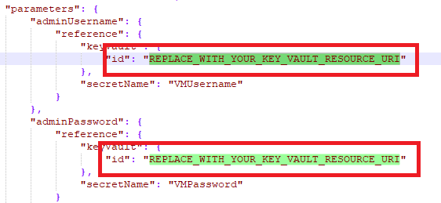

    -  Save the file.

5.  Execute the script in PowerShell by entering the following command: 

    >**Note**: You need to be in the AzureTemplates directory.

    ```
    .\deploy-securingpaas.ps1

    ```

6.  If prompted, type **Y**, then login as your subscription/resource group admin when prompted.  If prompted, type **Y**.

    

7.  Switch to your Azure Portal, select **SQL Servers**. You should see a new SQL Server available that will be using the username and password values from your key vault:

    

## Exercise 4: Securing the web application and database

Duration: 45 minutes

Synopsis: In this exercise, attendees will utilize Azure SQL features to data mask database data and utilize Azure Key Vault to encrypt sensitive columns for users and applications that query the database.

### Task 1: Setup the database

1.  Return to the Azure portal window where you are logged in with your user account, not the Key Vault account.

2.  Navigate to your resource group by selecting **Resource groups**, entering your resource group name in the Filter box, and selecting it from the list.

    

3.  From the list of resources in your resource group, select the **sampledb** SQL database which was created by the ARM template you ran in the Before the hands-on lab exercise.

    

4.  In the summary section, select the **Show database connection strings**.

    

5.  Take note of the connection string for later in this lab, specifically the **Server** parameter:

    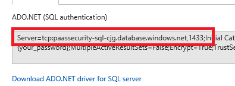

6.  Open **SQL Server Management Studio**

7.  In the Connect to Server dialog:

    a.  **Server name:** Enter the database **server name** from above.

    b.  **Authentication**: Select SQL Server Authentication.

    c.  **Login**: Enter **wsadmin**.

    d.  **Password**: Enter **p\@ssword1rocks**.
    
    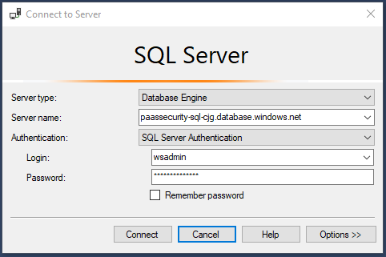

    e.  Select **Connect**.

8.  If presented with the New Firewall Rule dialog, select **Sign In**.

    

9.  Sign in as your Azure tenant admin.

10. In the dialog, select **OK**, notice how your IP address will be added for connection.

11. Right-click **Databases**, select **Import Data-tier Application**.

    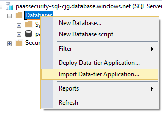

12. In the Introduction dialog, select **Next**.

13. Select **Browse**.

    

14. Navigate to the extracted /**Database** directory, select the **FourthCoffee.dacpac** file.

15. Select **Open**.

16. On the **Import Settings** dialog, select **Next**.

17. On the **Database Settings** dialog, select **Next**.

    >**Note**: If you get an error, close and re-open SSMS and try the import again. This can happen when you use a non-fresh installed SQL Managemnet Studio and have reminents of older verions.

    

18. Select **Finish**, the database will deploy to Azure.

    

19. Once completed, select **Close**.

20. In **SSMS**, select **File-\>Open-\>File**.

21. Browse to the extracted GitHub folder, select the **\\Hands-on lab\\Database\\00\_CreateLogin.ps1** file.

22. Ensure that the **master** database is selected.

    

23. **Press F5** to run the script to create a login called **store**.

24. Ensure that the **FourthCoffee** database is selected.

25. Browse to the extracted folder, select the **\\Hands-on lab\\Database\\01\_CreateUser.ps1** file.

26. **Press F5** to run the script to create a non-admin user called **store**.

    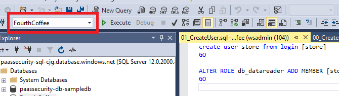

### Task 2: Test the web application solution

1.  In the extracted directory, double-click the **/WebApp/FourthCoffeeAPI/FourthCoffeeAPI.sln** solution file to open the solution in Visual Studio 2017 Community edition.

    a.  If prompted in the Visual Studio Version Selector, select Visual Studio 2017 as the program with which to open the solution.

    b.  Login to Visual Studio when prompted.

2.  In the **Solution Explorer**, navigate to and double select the **web.config** file to open it.

3.  In the **web.config**, locate the database connection string (line 72), and update the "data source" property to point to the **FourthCoffee** database created in Task 2. You should only need to update the server name to point to your Azure SQL Server.

    

4.  Save the Web.config file.

5.  Run the **FourthCoffeeAPI** solution, press **F5**.

6.  In the browser window that opens, browse to [http://localhost:\[PORT-NUMBER\]/api/CustomerAccounts](http://localhost:[PORT-NUMBER]/api/CustomerAccounts), and you should get a JSON response that shows an unmasked credit card column:

    

    >**Note**: depending on your browser, you may need to download to view the JSON response.

### Task 3: Utilize data masking

1.  Switch to the Azure Portal.

2.  Select **SQL databases**.

3.  Select the **FourthCoffee** database.

4.  In the menu, select **Dynamic Data Masking**, then select **+Add Mask**.

    

5.  In the Add masking rule blade, enter the following:

    a.  **Schema**: Leave **dbo** selected.

    b.  **Table**: Select **CustomAccount**.

    c.  **Column**: Select **CreditCardNumber**.

    d.  **Masking field format**: Select **Credit card value (xxxx-xxxx-xxxx-1234)**.
    
    

    e.  Select **Add**.

6.  Select **Save**.

7.  Switch back to your **FourthCoffeeAPI** solution, refresh the page, you should see the **CreditCardNumber** column is now masked with **xxxx-xxxx-xxxx-1234**.

    >**Note**: If you do not see this, then you are logged in as a user with dbo privileges.
    
    

8.  Close **Visual Studio**.

### Task 4: Utilize column encryption with Azure Key Vault

1.  Switch to **SQL Management Studio**.

2.  In the extracted directory, navigate to the **Database** directory.

3.  Open the **02\_PermissionSetup.sql** file, copy and paste the TSQL to the Query Window.

4.  Switch to the **FourthCoffee** database, execute the SQL statement.

5.  In the **Object Explorer**, expand the **FourthCoffee** node.

6.  Expand the **Tables** node.

7.  Expand the **CustomerAccount** table node.

8.  Expand the **Columns** node.

9.  Right-click the **CreditCardNumber** column, select **Encrypt Column**.

    

10. Select **Next** on the intro screen.

11. Notice that the State of the column is such that you cannot add encryption (data masking):

    

12. Select **Cancel**, then **Yes** to confirm.

13. Switch back to the Azure Portal, select the CustomerAccount.CreditCardNumber data masking.

14. Select **Delete**.

    

15. Select **Save**.

16. Switch back to **SQL Management Studio**.

17. Right-click the **CreditCardNumber** column, select **Encrypt Column**.

18. Check the checkbox next to the **CreditCardNumber** column.

19. For the **Encryption Type**, select **Deterministic**.

    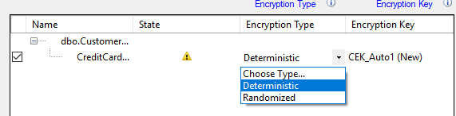

20. Select **Next**.

21. For the encryption, select **Azure Key Vault**, in the dialog.

    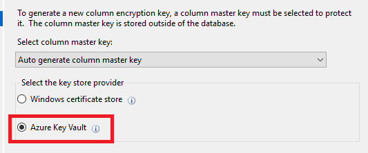

22. Select **Sign In**.

23. Sign in with your Azure Portal credentials.

24. Select your Azure Key Vault.

    

25. Select **Next**.

26. On the **Run Settings**, leave **Proceed to finish now** selected, and select **Next**.

27. Select **Finish**, the configured will start. If prompted, login using your Azure Portal credentials.

    >**Note**: You may receive a "wrapKey" error, if so, ensure that your account has been assigned that permissions in the Azure Key Vault.

    

    a.  Select **Key vault**.

    b.  Select your key vault.

    c.  Select **Access policies**.

    d.  Select your account.

    e.  Select **Key permissions**, select **Select all**.

       

    f.  Select **Secret permissions**, select **Select all**.

    g.  Select **Certificate permissions**, select **Select all**.

    h.  Select **OK**.

    i.  Select **Save**.

    j.  Retry the operation.

       

28. Select **Close**.

29. Right-click the **CustomerAccount** table, select **Select top 1000 rows**.

30. You will notice the **CreditCardNumber** column is encrypted based on the new Azure Key Vault key.

31. Switch to the Azure Portal.

32. Select **Key Vaults**.

33. Select your Azure Key Vault, then select **Keys**. You should see the key created from the SQL Management Studio displayed:

    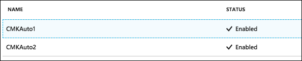

### Task 5: Enable Azure SQL Auditing & Threat Detection

1.  In the Azure portal, select **SQL Databases**, and select the **FourthCoffee** database.

    

2.  Select **Auditing**.

    

3.  For Auditing, toggle to **ON**.

4.  Select **Storage details**.

5.  Select **Storage account**, select your storage account.

6.  Select **OK**.

7.  Select **Save**, then select **OK**

8.  In the **FourthCoffe** blade, select **Advanced Thread Protection**.

9.  Select **Enable Advanced Threat Protection on the server** button.

    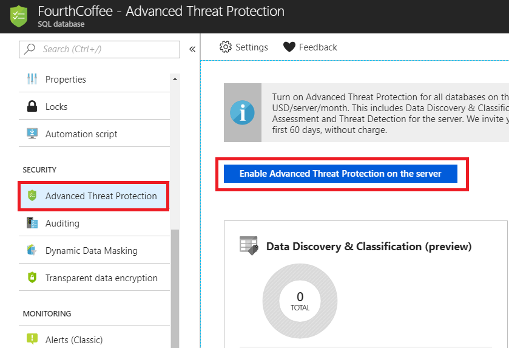

### Task 6: Ensure SQL Azure Transparent Data Encryption (TDE) is enabled

1.  In the **FourthCoffee** blade, select **Transparent data encryption**.

2.  For data encryption, ensure that the toggle is set to **ON**.

    >**Note**: For newly created databases, this is automatically enabled.

    

3.  If you toggled the button, select **Save**.

    

## Exercise 5: Migrating web.config settings to Azure Key Vault

Duration: 30 minutes

Synopsis: In this exercise, attendees will learn how to migrate web application to utilize Azure Key Vault rather than storing valuable credentials (such as connection strings) in application configuration files.

### Task 1: Create an Azure Key Vault secret

1.  From the extracted GitHub directory, open the **\\Hands-on lab\\WebApp\\FourthCoffeeAPI\_KeyVault\\FourthCoffeeAPI.sln** solution.

2.  Switch to your Azure Portal.

3.  Select **Key Vaults**, then select your Azure Key Vault.

4.  Select **Secrets**, then select **+Generate/Import**.

5.  For the **Upload Options**, select **Manual**.

6.  For the **Name**, enter **FourthCoffeeAPI**.

7.  For the **Value,** copy the connection string information from the FourthCoffeeAPI solution web.config file on line 77:

    

8.  Select **Create**.

9.  Select **Secrets**.

10. Select **FourthCoffeeAPI**.

11. Select the current version.

    

12. Copy and record the secret identifier URL for later use.

    


### Task 2: Create an Azure Active Directory application

1.  Select **Azure Active Directory**, then select **App Registrations**.

    

2.  Select **+New application registration**.

3.  For the name, enter **AzureKeyVaultTest**.

4.  For the Sign-on URL, enter <http://localhost:12345>.

    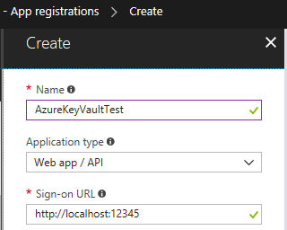

5.  Select **Create**.

6.  Select the new **AzureKeyVaultTest** application.

7.  Copy and record the **Application ID** for later use.

8.  Copy and record the **Object ID** for later use.

    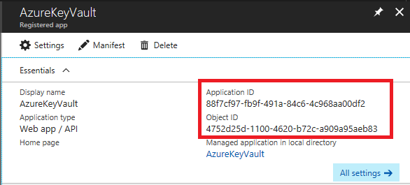

9.  Select **Settings**.

10. Select **Keys**.

11. For Description, enter **FourthCoffeeAPI**.

12. For Expires, select **In 1 year**.

13. Select **Save**.

    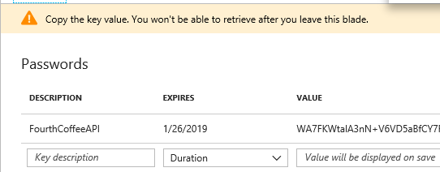

14. Copy and record the key value for later use.

### Task 3: Assign the new Application Azure Key Vault permissions

1.  Switch back to Azure Portal and select your Azure Key Vault.

2.  Select **Access Policies**.

3.  Select **+Add New**.

    

4.  Select **Select principal**, enter **AzureKeyVaultTest**.

5.  Select the application service principal, click **Select**.

6.  Select the **Secret permissions** drop down, check the **Get** and **List** permissions.

    

7.  Select **OK**.

8.  Select **Save**.

### Task 4: Install NuGet packages

1.  Switch to **Visual Studio**, close the current solution.  Open the FourthCoffeeAPI_KeyVault solution.

2.  In the menu, select **View-\>Other Windows-\>Package Manager Console**.

    

3.  In the new window that opens, run the following commands (NOTE that these already exist in the project but are provided as a reference):

```PowerShell
    Install-Package Microsoft.IdentityModel.Clients.ActiveDirectory -Version 2.16.204221202.

    Install-Package Microsoft.Azure.KeyVault.

    Update-Package -Reinstall
```

4.  From **Solution Explorer**, double-select the **web.config** file to open it.

5.  Notice the **appSettings** section has some token values:

    

6.  Replace the values as follows:

    a.  **ClientId**: Replace with the Application ID value copied in Task 2, Step 7.

    b.  **CllientSecret**: Replace with the FourthCoffeeAPI Key values from copied in Task 2, Step 14.

    c.  Replace the **SecretUri**: Replace with the Azure Key Vault secret key Uri from Task 1, Step 12.

7.  Save Web.config.

### Task 5: Test the solution

1.  In the **web.config**, delete the **connectionString** from the file at line 78.

2.  Save the **web.config** file.

3.  Open the **global.asax.cs** file, place a break point at line 31.

    >**Note**: This code makes a call to get an accessToken as the application you setup above, then make a call to the Azure Key Vault using that accessToken.

4.  Run the solution, press **F5**.

5.  You should see that you execute a call to Azure Key Vault and get back the secret (which in this case is the connection string to the Azure Database).

    

6.  Press **F5**, and navigate to [http://localhost:\[PORT-NUMBER\]/api/CustomerAccounts](http://localhost:[PORT-NUMBER]/api/CustomerAccounts), you should see your data displayed (again note that some browsers may not display the json file in the browser).

## Exercise 6: Securing PaaS web applications with App Service Environment and Web Application Firewall 

Duration: 45 minutes

Synopsis: In this exercise, attendees will deploy a cloud web application with a web application gateway and firewall enabled.

### Task 1: Deploy web application to App Service Environment

1.  Search for and select **App Service Plan**.

    

2.  Select **+Add**.

3.  For the name, enter **paassecurity-\[your initials\]**.

4.  Select your resource group.

5.  Select **Location**, then select your **paassecurity-ase-\[your initials\]** App Service Environment.

6.  Select **Pricing tier**, for the pricing tier select **l1 Isolated**.

    

7.  Select **Select**.

    

8.  Select **Create**.

9.  Switch to your jump VM that is running inside your Azure subscription.

    >**Note**: You cannot publish from outside the Azure Virtual Network to an internal ASE.

10. Open the extracted folder solution **\\Hands-on lab\\WebApp\\FourthCoffeeWeb.sln**.

    >**Note**: If the project does not load, remove the project file and open the folder as an **Existing web site**.

    a.  Select **Sign in**, enter your username, select **Next**.

    b.  Enter your password.

11. Select **Sign In**.

12. Right-click the project, select **Publish Web App**.

    

13. Select **Microsoft Azure App Service**.

    

14. If prompted, select **Reenter your credentials** such that they match the Azure Subscription you are deploying to.

15. Select **New**.

16. Select your subscription.

17. Select your resource group.

18. For App Service Plan, select the **paassecurity-\[your initials\]**.

    

19. Select **Create**, in the publish window, copy the url of the deployment url.

    >**Note** In some versions of Visual Studio, you may need to do this twice.

20. Take note of the URL that your app will be published to:

    a.  Switch to the Azure Portal.

    b.  Select **App Service Environment**.

    c.  Select your **App Service Environment**.

    d.  Select **IP Addresses**.

    e.  Take note of your App Service Environment Internal Load Balancer IP Address.

    

    f.  On your jump VM, open **Notepad as an administrator**.

    g.  Open the **c:\\windows\\system32\\drivers\\etc\\hosts** file, add the url you copied from the publish window above, save the hosts file.

    

21. Switch back to Visual Studio, select **Validate Connection**, if prompted, select **Accept** for the certificate:

    

22. The connection should validate with a green checkmark:

>**Note**: You may need to click it twice.

   

23. Record the destination URL for later in this exercise.

24. Select **Publish**.

    >**Note**: If you get an error, you may be trying to publish outside of the Azure Virtual Network or you did not setup a DNS/Hosts entry for your custom internal domain.

    

25. Your web application should be published successfully:

    

### Task 2: Configure the Web Application Firewall

1.  Switch back to the Azure Portal, select **Application gateways**.

2.  Select your application gateway.

3.  Select **Overview**, record the public IP address of the application gateway for later use:

    

4.  Select **Backend pools**.

5.  Select the single backend pool displayed, ensure the IP address is that of the ASE internal load balancer IP. If it is not, delete the one displayed and add the correct IP:

    

6.  Close the dialog, then select **Health probes**.

7.  Select **+Add**.

8.  Copy the web app DNS address into the name and host address (do not copy the schema).

9.  For the path, enter **/**.

    

10. Select **OK** and then wait for the web application gateway to finish updating, this can take 5-10 minutes.

    >**Note**: If the operation fails, retry it.

    >**Note**: If you do not wait, future actions may result in the following error:

    

11. Select **HTTP settings**.

12. Select the only **backendHttpSetting** item.

13. Check the **Use custom probe** checkbox.

14. Select the custom probe you just added.

    >**Note**: This will make it such that the WAF knows about the host header of the incoming requests and where to route them.

    

15. Select **Save**, wait for the application gateway to finish updating again this could take 5-10 minutes.

### Task 3: Enable Application Gateway logging

1.  Select **Diagnostic Logs**.

2.  Select **Turn on diagnostics**.

    

3.  For the name, enter **paassecurity-waf-logging**.

4.  Check the **Send to Log Analytics** checkbox.

5.  For **Log Analytics**, select your default workspace.

    >**Note**: If you do not have a workspace, create one.

6.  Check all **LOG** checkboxes.

    

7.  Select **Save**.

### Task 4: Attack a ASE Web Application with Detection Only

1.  Switch to your jump VM.

2.  Edit the c:\\windows\\system32\\drivers\\etc\\hosts file to update the web app URL to point to the WAF public IP Address:

    

3.  Save the file.

4.  Open a browser window, ensure that the web site opens successfully.

5.  **Launch Fiddler** on your jump VM, so you can observe the network traffic resulting from the following step.

6.  Open a **Windows PowerShell ISE** window.

7.  From the extracted folder, open the **/Scripts/WebAttack.ps1**.

8.  Run the script, when prompted, enter the following information:

    a.  Web application IP address;

    b.  Web application DNS.

    

>**Note**:  You may need to change the execution policy:

```PowerShell
    Set-ExecutionPolicy -ExecutionPolicy Unrestricted
```

9.  The script will execute a series of attacks on the Azure web application. Although they won't technically be successful, they will make it to the web application. In Fiddler, select the various request and then click the **Inspectors** tab.  You will be able to see the traffic is allowed, even wotj known bad agents:

    

### Task 5: Enable Web Application Firewall Prevention

1.  In the Azure portal, select **Application gateway**.

2.  Select your application gateway.

3.  Select **Web application firewall**.

4.  For **Firewall mode**, select the **Prevention**.

5.  For **File upload limit (MB)**, select the **100**.

    

6.  Select **Save**, wait for the application gateway to be updated.

### Task 6: Reattack an ASE Web Application with Prevention enabled

1.  Switch back to the **Windows PowerShell ISE** window.

2.  Run the WebAttack script, then when prompted, enter the following information:

    a.  Web application gateway IP address

    b.  Web application gateway DNS

3.  In Fiddler, you should see that your attack is being prevented from making it to the web server. This will also generate logs that we will use to create attack assessment reports in later exercises. Again, with fiddler available, you can see the denied traffic by selecting the Inspectors tab, then Headers in the top section, and Raw in the bottom section:

    

## Exercise 7: Securing Azure Functions with Managed Service Identities 

Duration: 30 minutes

Synopsis: In this exercise, attendees will learn how to use Azure Functions that access Azure Key Vault as a Managed Service Identity.

### Task 1: Create an Azure Function

1.  Click **+Create a resource**, then type "function".  Select **Function App**, then select **Create**

2.  For the name, enter **MSIKeyVaultFunc-\[Your Initials\]**.

3.  Select your resource group.

4.  Ensure that your location matches what you have been using.

5.  For **Storage**, select the storage account.

6.  Select **Application Insights**, select **Enabled**, then select **Apply**.

7.  Select **Create**.

8.  Select **Function Apps**.

9.  Once provisioning completes, select your new function app by clicking **All services** then searching for "function" and then selecting **Function Apps**.

10.  Expand your new function app node, select the **Functions** node.

11. Select **New function**.

    

12. Select **HTTP trigger**.

    

13. Keep the name **HttpTrigger1**.

    

14. Select **Create**.

15. Open the extracted folder file **\\Hands-on lab\\AzureFunction\\run.csx**.

16. Copy the contents into the window.

    

17. Select **Save**.

18. On the right, select **View Files**.

    >**Note**: You may need to scroll to the right to see the View Files tab.

19. Select **+Add**.

20. For the name, enter **project.json**.

    

21. Press **Enter**.

22. Open the **\\Hands-on lab\\AzureFunction\\project.json** file, copy the contents to the online version.

24. Select **Save**.

### Task 2: Create a Managed Service Identity

1.  Select the **MSIKeyVaultFunc-\[your initials\]** function node.

2.  Select the **Platform features** tab.

    

3.  Under **Networking**, select **Identity**.

    

4.  For the **Status** setting, toggle it to **On**.

    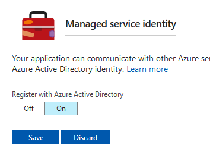

5.  Select **Save**, in the popup, select **Yes**

### Task 3: Assign Managed Service Identity Azure Key Vault permissions

1.  In the Azure Portal navigation, select **Key vaults**.

2.  Select your key vault.

3.  Select **Access policies**.

4.  Select **+Add new**.

    

5.  Select the **Select principal**.

6.  Search for the **MSIKeyVaultFunc** application, select it.

    

7.  Select **Select**.

8.  Select the **Secret permissions** drop down, check the **Get** and **List** permissions.

    

9.  Select **OK**.

10. Select **Save**, you should now see the application listed:

    

### Task 4: Test your Azure Function

1.  Select **Key vaults**.

2.  Select **Secrets**.

3.  Select **+Generate/Import**.

    >**Note**: If you can't add a new Secret, you will need to assign yourself permission to do so via Access policies.

4.  In **Upload options**, select **Manual**.

5.  For the **name**, enter **FunctionSecret**.

6.  For the **value**, enter **HelloWorld**.

    

7.  Select **Create**.

8.  Select **FunctionSecret**.

9.  Select the current version, then select and record the Secret Identifier URL.

    

10. Select **Function Apps**.

11. Select **MSIKeyVaultFunc-\[your initials\]**.

12. Select **Application Settings**.

    

13. Under **Application Settings**, select **+Add new setting**.

14. For the **name**, enter **KeyVaultUri**.

15. For the **value**, copy the Secret Identifier URL you copied in this task.

16. Scroll to the top, select **Save**.

17. Select the **HttpTrigger1** function.

18. Select **Run**.

    

19. In the Output window you should see your Key Vault Secret displayed.

    

## Exercise 8: Creating PaaS Audit and Compliance Power BI Reports 

Duration: 20 minutes

Synopsis: In this exercise, attendees will learn to utilize the Log Analytics feature of Azure to create Power BI Reports.

### Task 1: Export a Power Query formula from Log Analytics

1.  Select **Monitor**, then select **Logs**.

    

2.  In the query textbox, update the search textbox to be:

``` 
search * | where Type == "SecurityDetection**.**"
```

   >**Note**: If you wanted to see things that were specific from your IP address you can add **\| where ExtendedProperties contains "X.X.X.X"** to the query.

4.  Select the **Run** button.

5.  In the search dialog, select the **Export** link, then select **Export to Power BI (M Query)**

    

6.  Select **Open**, a text document with the Power Query M Language will be displayed.

7.  Follow the instructions in the document to execute the query in Power BI.

    

8.  Close **Power BI**.

## After the hands-on lab 

Duration: 10 minutes

In this exercise, attendees will deprovision any Azure resources that were created in support of the lab.

### Task 1: Delete resource group

1.  Using the Azure portal, navigate to the Resource group you used throughout this hands-on lab by selecting **Resource groups** in the left menu.

2.  Search for the name of your resource group and select it from the list.

3.  Select **Delete** in the command bar and confirm the deletion by re-typing the Resource group name and selecting **Delete**.

### Task 2: Delete Azure AD objects

1.  Navigate to Azure Active Directory in the Azure portal.

2.  Delete the groups you created:

    a.  Key Vault Mgmt Admins

    b.  Key Vault Key Admins

3.  Delete the users you created:

    a.  Key Vault Admin

    b.  Key Vault Auditor

    c.  Key Vault Developer

4.  Delete the App you registered:

    a.  Select App registrations.

    b.  Select View all applications.

    c.  Select and delete the AzureKeyVaultTest app.

### Task 3: Delete lab environment (optional)

1.  If you are using a hosted platform, make sure you shut it down/delete it

You should follow all steps provided *after* attending the Hands-on lab.

