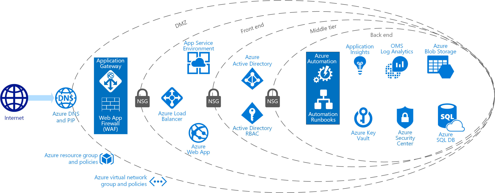

Securing PaaS

Whiteboard design session trainer guide

December 2018

Information in this document, including URL and other Internet Web site references, is subject to change without notice. Unless otherwise noted, the example companies, organizations, products, domain names, e-mail addresses, logos, people, places, and events depicted herein are fictitious, and no association with any real company, organization, product, domain name, e-mail address, logo, person, place or event is intended or should be inferred. Complying with all applicable copyright laws is the responsibility of the user. Without limiting the rights under copyright, no part of this document may be reproduced, stored in or introduced into a retrieval system, or transmitted in any form or by any means (electronic, mechanical, photocopying, recording, or otherwise), or for any purpose, without the express written permission of Microsoft Corporation.

Microsoft may have patents, patent applications, trademarks, copyrights, or other intellectual property rights covering subject matter in this document. Except as expressly provided in any written license agreement from Microsoft, the furnishing of this document does not give you any license to these patents, trademarks, copyrights, or other intellectual property.

The names of manufacturers, products, or URLs are provided for informational purposes only, and Microsoft makes no representations and warranties, either expressed, implied, or statutory, regarding these manufacturers or the use of the products with any Microsoft technologies. The inclusion of a manufacturer or product does not imply endorsement of Microsoft of the manufacturer or product. Links may be provided to third-party sites. Such sites are not under the control of Microsoft and Microsoft is not responsible for the contents of any linked site or any link contained in a linked site, or any changes or updates to such sites. Microsoft is not responsible for webcasting or any other form of transmission received from any linked site. Microsoft is providing these links to you only as a convenience, and the inclusion of any link does not imply endorsement of Microsoft of the site or the products contained therein.

© 2018 Microsoft Corporation. All rights reserved.

Microsoft and the trademarks listed at <https://www.microsoft.com/en-us/legal/intellectualproperty/Trademarks/Usage/General.aspx> are trademarks of the Microsoft group of companies. All other trademarks are the property of their respective owners.

**Contents** 

<!-- TOC -->

- [Trainer: Action required](#trainer-action-required)
- [Trainer information](#trainer-information)
    - [Role of the trainer](#role-of-the-trainer)
    - [Whiteboard design session flow](#whiteboard-design-session-flow)
    - [Before the whiteboard design session: How to prepare](#before-the-whiteboard-design-session-how-to-prepare)
    - [During the whiteboard design session: Tips for an effective whiteboard design session](#during-the-whiteboard-design-session-tips-for-an-effective-whiteboard-design-session)
- [Securing PaaS whiteboard design session student guide](#securing-paas-whiteboard-design-session-student-guide)
    - [Abstract and learning objectives](#abstract-and-learning-objectives)
    - [Step 1: Review the customer case study](#step-1-review-the-customer-case-study)
        - [Customer situation](#customer-situation)
        - [Customer needs](#customer-needs)
        - [Customer objections](#customer-objections)
        - [Infographic for common scenarios](#infographic-for-common-scenarios)
    - [Step 2: Design a proof of concept solution](#step-2-design-a-proof-of-concept-solution)
    - [Step 3: Present the solution](#step-3-present-the-solution)
    - [Wrap-up](#wrap-up)
    - [Additional references](#additional-references)
- [Securing PaaS whiteboard design session trainer guide](#securing-paas-whiteboard-design-session-trainer-guide)
    - [Step 1: Review the customer case study](#step-1-review-the-customer-case-study-1)
    - [Step 2: Design a proof of concept solution](#step-2-design-a-proof-of-concept-solution-1)
    - [Step 3: Present the solution](#step-3-present-the-solution-1)
    - [Wrap-up](#wrap-up-1)
    - [Preferred target audience](#preferred-target-audience)
    - [Preferred solution](#preferred-solution)
    - [Checklist of preferred objection handling](#checklist-of-preferred-objection-handling)
    - [Customer quote (to be read back to the attendees at the end)](#customer-quote-to-be-read-back-to-the-attendees-at-the-end)

<!-- /TOC -->

# Trainer: Action required 

To ensure you can begin the course delivery on-time, you must take the following steps at least 5-hours prior to the course start time:

-   Run the Azure resource template -- The Application Service Environment can take *more* than 90-minutes to create.

>**Note**: During the Web Application Firewall (WAF) exercises, attendees may have to wait 15-minutes or more for the background configurations to take affect. For this reason, you may want to consider conducting a demonstration or other presentation to take advantage of this wait time.

# Trainer information

Thank you for taking time to support the whiteboard design sessions as a trainer!

## Role of the trainer

An amazing trainer:

-   Creates a safe environment in which learning can take place.

-   Stimulates the participant's thinking.

-   Involves the participant in the learning process.

-   Manages the learning process (on time, on topic, and adjusting to benefit participants).

-   Ensures individual participant accountability.

-   Ties it all together for the participant.

-   Provides insight and experience to the learning process.

-   Effectively leads the whiteboard design session discussion.

-   Monitors quality and appropriateness of participant deliverables.

-   Effectively leads the feedback process.

## Whiteboard design session flow 

Each whiteboard design session uses the following flow:

**Step 1: Review the customer case study (15 minutes)**

**Outcome**

Analyze your customer's needs.

-   Customer's background, situation, needs and technical requirements

-   Current customer infrastructure and architecture

-   Potential issues, objectives and blockers

**Step 2: Design a proof of concept solution (60 minutes)**

**Outcome**

Design a solution and prepare to present the solution to the target customer audience in a 15-minute chalk-talk format.

-   Determine your target customer audience.

-   Determine customer's business needs to address your solution.

-   Design and diagram your solution.

-   Prepare to present your solution.

**Step 3: Present the solution (30 minutes)**

**Outcome**

Present solution to your customer:

-   Present solution

-   Respond to customer objections

-   Receive feedback

**Wrap-up (15 minutes)**

-   Review preferred solution

## Before the whiteboard design session: How to prepare

Before conducting your first whiteboard design session:

-   Read the Student guide (including the case study) and Trainer guide.

-   Become familiar with all key points and activities.

-   Plan the point you want to stress, which questions you want to drive, transitions, and be ready to answer questions.

-   Prior to the whiteboard design session, discuss the case study to pick up more ideas.

-   Make notes for later.

## During the whiteboard design session: Tips for an effective whiteboard design session

**Refer to the Trainer guide** to stay on track and observe the timings.

**Do not expect to memorize every detail** of the whiteboard design session.

When participants are doing activities, you can **look ahead to refresh your memory**.

-   **Adjust activity and whiteboard design session pace** as needed to allow time for presenting, feedback, and sharing.

-   **Add examples, points, and stories** from your own experience. Think about stories you can share that help you make your points clearly and effectively.

-   **Consider creating a "parking lot"** to record issues or questions raised that are outside the scope of the whiteboard design session or can be answered later. Decide how you will address these issues, so you can acknowledge them without being derailed by them.

***Have fun**! Encourage participants to have fun and share!*

**Involve your participants.** Talk and share your knowledge but always involve your participants, even while you are the one speaking.

**Ask questions** and get them to share to fully involve your group in the learning process.

**Ask first**, whenever possible. Before launching into a topic, learn your audience's opinions about it and experiences with it. Asking first enables you to assess their level of knowledge and experience, and leaves them more open to what you are presenting.

**Wait for responses**. If you ask a question such as, "What's your experience with (fill in the blank)?" then wait. Do not be afraid of a little silence. If you leap into the silence, your participants will feel you are not serious about involving them and will become passive. Give participants a chance to think, and if no one answers, patiently ask again. You will usually get a response.

## Abstract and learning objectives 

In this whiteboard design session, you will work with a group to design an end-to-end PaaS solution that combines many of Azure's security features, while protecting sensitive data from both internal and external users.

At the end of this whiteboard design session, you will be better able to design secure PaaS-based solutions that protect your systems and data from both internal and external threats.

## Step 1: Review the customer case study 

**Outcome**

Analyze your customer's needs.

Timeframe: 15 minutes

Directions: With all participants in the session, the facilitator/SME presents an overview of the customer case study along with technical tips.

1.  Meet your table participants and trainer.

2.  Read all of the directions for steps 1-3 in the student guide.

3.  As a table team, review the following customer case study.

### Customer situation

Fourth Coffee is an American coffeehouse chain that was founded in Seattle, Washington in 1970. It currently operates over 20,000 locations worldwide.

Victoria Gray, CEO of Fourth Coffee, has established a mandate to revamp their loyalty program that starts with their platform. Currently they provide gift cards that customers can purchase in-store and use at any of their locations. These gift cards can be "re-loaded" with funds by payment by the customer as an in-store transaction. Other than tracking the serial number of the gift card, its balance and purchase history, Fourth Coffee does not have any direct way to associate the purchase history with the customer. They feel this is a big opportunity for them to address, and in doing so will enable them to launch their worldwide customer loyalty program.

They would like to enable their customers to register online to associate any gift cards with their profile. Customers should be able to self-manage their gift card collection, check balances and in the future, receive loyal customer benefits like free coffees or offers to try some of the newest bakery items. At this time, Fourth Coffee is not concerned with enabling customers to "re-load" their cards online. In addition to gift card management, Fourth Coffee would like to enable logged-in users to provide reviews about Fourth Coffee products. They like the idea of coupling reviews to actual gift card users and see a future in which they might reward frequent reviewers with bonus funds on their registered gift cards. These reviews would need to be publicly available and free-text searchable from the website.

In designing and implementing this solution, Fourth Coffee is very concerned about security. They had already launched a customer profile microsite alongside their primary website in Azure using Azure App Services, they host the website in a Web App and all logic is provided thru an API App. They would like to keep this core approach for the gift card website but extend it as appropriate with other Azure PaaS services.

The current customer profile microsite is built with ASP.NET Identity Providers and stores the customer logins and passwords in Azure SQL Database. This was sufficient when the only functionality this site provided was effectively opt-in/out of promotional emails. Now that they will be storing more sensitive information about the customer, they would like to revisit this approach.

A primary concern for Fourth Coffee is figuring out how to secure access to this sensitive data, particularly to limit and control access by their developers. They have put together a "solution security" team who works in the office of the CISO (Chief Information Security Officer) that should be the only group allowed to view the secrets and keys used in production. The developers have expressed concern that this separation of duties, while admirable, is not possible and will prevent them from getting their job done or make it difficult to troubleshoot issues in production.

In addition to securing access to sensitive data, they would like to gain visibility into the security health of their solution. They need guidance on how to they should make sense of all the logs, events and metrics available from the Azure services and are curious if there is anything that can help them monitor their security posture and identify potential issues automatically.

They would like to start designing a pilot solution for one region, that if successful, they could deploy globally down the road.

### Customer needs 

1.  Safeguard and manage identity of users and services.

2.  Detect and respond to identity-based threats.

3.  Detect and respond to threats to their applications and solutions.

4.  Gain visibility into security health.

5.  Secure the loyalty data at rest and in transit. Allow access only to those who have a need.

6.  They want to achieve the right balance of security versus complexity.

7.  Security centered around PaaS services. 

 ### Customer objections 

1.  Can we really set it up, so our developers' applications have access to the connection strings, keys and other secrets at run time, without enabling the developers themselves to access this sensitive data?

2.  We've been told over and over again that Azure's services, like Azure SQL Database and Azure Storage, must always have a public endpoint. Is that really true?

3.  We heard the announcement about Managed Service Identity. We recognize it is in preview now, but we would like to understand how it would improve the security of the solution you are recommending to us.

4.  We need to be certain that all of our data is encrypted when it is stored on disk, is that possible with the PaaS services you are recommending?

### Infographic for common scenarios

## Step 2: Design a proof of concept solution

**Outcome**

Design a solution and prepare to present the solution to the target customer audience in a 15-minute chalk-talk format.

Timeframe: 60 minutes

**Business needs**

Directions:  With all participants at your table, answer the following questions and list the answers on a flip chart:

1.  Who should you present this solution to? Who is your target customer audience? Who are the decision makers?

2.  What customer business needs do you need to address with your solution?

**Design**

Directions: With all participants at your table, respond to the following questions on a flip chart:
*High-level architecture*

1.  Without getting into the details, (the following sections will address the particular details), diagram your initial vision for handling the top-level requirements for the gift card website, gift card API, and the storage for customer profiles and transactions. You will refine this diagram as you proceed.

2.  What data would you consider sensitive in this scenario? Is there a compliance standard that you would recommend Fourth Coffee consider building their solution against?

*Securing customer identity*

1.  Fourth Coffee mentioned a desire to improve how they manage and store the identities of their customers, for use when granting them access to their online profiles. What approach would recommend they take to modernize their identity management?

2.  Would the approach you suggested still allow customers who do not want to use social accounts to create a login with Fourth Coffee?

3.  One of Fourth Coffee's biggest frustrations with their existing identity management approach is that when customers forget their password, they typically must contact support, which is an expensive interaction for Fourth Coffee. How would your proposed solution improve this situation? What would be the process?

*Securing the core website components*

1.  The Fourth Coffee website should be publicly accessible, but the gift card API should not be accessible from the Internet. Additionally, all traffic flowing through to the website should pass through some kind of firewall to guard against malicious requests like cross-site scripting and SQL injection, and the website itself should never be directly accessible in any other way. How would you accomplish this?

2.  Fourth Coffee does not like the fact that their existing SQL Database deployment, which contains sensitive customer personally identifiable data (PII), has an endpoint that is accessible on the Internet. They have the firewall rules configured on the SQL Database Server to restrict access, but they would prefer a solution that does not have such a publicly exposed endpoint. What would you suggest and how would they accomplish this?

3.  Fourth Coffee is storing customer purchase history for the long term in Azure Storage blobs. Like their previous concern, they would like to know if they could remove the public endpoint access from Azure Storage, since the transaction data reflects sensitive financial transaction information.

4.  The existing API App is deployed with the connection string information to the SQL Database saved in the web.config. Fourth Coffee would like to improve the handling of sensitive configuration. What would you recommend they do and how would they need to change their app to support your recommendation?

*Enabling reviews*

1.  Fourth Coffee wants to be certain that their mini-platform for reviews can scale and are less concerned about securing the data (other than securing access to edit the reviews appropriately). How would you suggest Fourth Coffee deploy the logic for managing and navigating reviews, how would reviews (which could grow to become very large data sets) be stored?

2.  Fourth Coffee would like users to be able to search across reviews with free-form text, but also narrow their search by product, date range and number of stars. How would you enable end-users to search thru reviews?

3.  How would you secure access to the services you propose in support of reviews?

*Securing DevOps*

1.  Fourth Coffee is trying to think about the complete security of their solution, and one challenge they face is in securing how developers interact with production systems for the purposes of deployments as well as troubleshooting. How would restrict deployments to production Web App or API app from occurring across Internet available endpoints?

2.  With this safeguard in place, how will developers perform their deployments?

3.  They would also like to restrict what developers can see in the database (in terms of sensitive data like gift card data), what options do they have for this?

*Monitoring security health*

1.  What services would you suggest Fourth Coffee utilize in order to monitor the general health of the solution?

2.  What service would you suggest Fourth Coffee utilize to monitor the security health of the solution? What it would it provide for their solution?

**Prepare**

Directions: With all participants at your table:

1.  Identify any customer needs that are not addressed with the proposed solution.

2.  Identify the benefits of your solution.

3.  Determine how you will respond to the customer's objections.

Prepare a 15-minute chalk-talk style presentation to the customer.

## Step 3: Present the solution

**Outcome**

Present a solution to the target customer audience in a 15-minute chalk-talk format.

Timeframe: 30 minutes

**Presentation**

Directions:

1.  Pair with another table.

2.  One table is the Microsoft team and the other table is the customer.

3.  The Microsoft team presents their proposed solution to the customer.

4.  The customer makes one of the objections from the list of objections.

5.  The Microsoft team responds to the objection.

6.  The customer team gives feedback to the Microsoft team.

7.  Tables switch roles and repeat Steps 2-6.

##  Wrap-up 

Timeframe: 15 minutes

Directions: Tables reconvene with the larger group to hear the facilitator/SME share the preferred solution for the case study.

##  Additional references

|    |            |
|----------|:-------------:|
| **Description** | **Links** |
| A reference architecture for building a solution that enables PCI compliance using Azure PaaS services   | <https://docs.microsoft.com/en-us/azure/security/blueprints/payment-processing-blueprint>  |
|   Securing Azure Key Vault - Documentation on how to separate management and data access capabilities when securing Key Vault | <https://docs.microsoft.com/en-us/azure/key-vault/key-vault-secure-your-key-vault>   |
|  Describes how Cosmos DB is secured     | <https://docs.microsoft.com/en-us/azure/cosmos-db/database-security>   |
| How to configure a WAF for an ASE v2 environment   |  <https://docs.microsoft.com/en-us/azure/app-service/environment/app-service-app-service-environment-web-application-firewall>  |
|  VNET Service Endpoints  |  <https://azure.microsoft.com/en-us/blog/announcing-virtual-network-integration-for-azure-storage-and-azure-sql/>   |

# Securing PaaS whiteboard design session trainer guide

## Step 1: Review the customer case study

-   Check in with your table participants to introduce yourself as the trainer.

-   Ask, "What questions do you have about the customer case study?"

-   Briefly review the steps and timeframes of the whiteboard design session.

-   Ready, set, go! Let the table participants begin.

## Step 2: Design a proof of concept solution

-   Check in with your tables to ensure that they are transitioning from step to step on time.

-   Provide some feedback on their responses to the business needs and design.

    -   Try asking questions first that will lead the participants to discover the answers on their own.

-   Provide feedback for their responses to the customer's objections.

    -   Try asking questions first that will lead the participants to discover the answers on their own.

## Step 3: Present the solution

-   Determine which table will be paired with your table before Step 3 begins.

-   For the first round, assign one table as the presenting team and the other table as the customer.

-   Have the presenting team present their solution to the customer team.

    -   Have the customer team provide one objection for the presenting team to respond to.

    -   The presentation, objections, and feedback should take no longer than 15 minutes.

    -   If needed, the trainer may also provide feedback.

## Wrap-up

-   Have the table participants reconvene with the larger session group to hear the facilitator/SME share the following preferred solution.

##  Preferred target audience

Victoria Gray, CEO of Fourth Coffee

The primary audience is the business decision makers and technology decision makers. Usually we talk to the infrastructure managers who report to the chief information officer (CIO), or to application sponsors (like a vice president \[VP\] line of business \[LOB\], or chief marketing officer \[CMO\]), or to those that represent the business unit IT or developers that report to application sponsors.

## Preferred solution

*High-level architecture*

1.  Without getting into the details, (the following sections will address the particular details), diagram your initial vision for handling the top-level requirements for the gift card website, gift card API, and the storage for customer profiles and transactions. You will refine this diagram as you proceed.

    

2.  What data would you consider sensitive in this scenario? Is there a compliance standard that you would recommend Fourth Coffee consider building their solution against?

    The gift card information, while not strictly speaking a credit card, is a financial instrument and should be secured following a similar approach to how credit card holder data is protected. You should recommend Fourth Coffee design their solution with the goal of achieving PCI DSS 3.0 compliance in mind. This would make for a secure solution today and down the road if Fourth Coffee decides they want to enable customers to re-load their cards online with payment by credit card, their solution is well designed to securely handle card holder data.
    
    In support of this, Microsoft provides a blueprint for Payment Processing for PCI DSS-compliant environments, which would serve as useful reference in designing the solution: <https://docs.microsoft.com/en-us/azure/security/blueprints/payment-processing-blueprint>

*Securing customer identity*

1.  Fourth Coffee mentioned a desire to improve how they manage and store the identities of their customers, for use when granting them access to their online profiles. What approach would recommend they take to modernize their identity management?

    They should "outsource" the identity management function to Azure Active Directory B2C instead of storing usernames and passwords in the Fourth Coffee SQL Database.

2.  Would the approach you suggested still allow customers who do not want to use social accounts to create a login with Fourth Coffee?

    Yes, AAD B2C enables applications to authenticate social accounts (e.g., Facebook, Google, LinkedIn), Enterprise accounts (e.g., integrated using open standard protocols, OpenID Connect or SAML) as well as local accounts (e.g., email address and password or username and password). Customers who do not want to use their social accounts could use local accounts in AAD B2C.

3.  One of Fourth Coffee's biggest frustrations with their existing identity management approach is that when customers forget their password, they typically must contact support- which is an expensive interaction for Fourth Coffee. How would your proposed solution improve this situation? What would be the process?

    AAD B2C provides a self-service password reset feature for users who have setup local accounts. Once self-service password reset is enabled in Active Directory, when a user arrives at a login screen a link labeled "Can't access your account?" appears. The consumer needs to enter their email address. If the email address belongs to a valid user, that address will be sent an email with a link allowing the recipient to reset the password.

*Securing the core website components*

1.  The Fourth Coffee website should be publicly accessible, but the gift card API should not be accessible from the Internet. Additionally, all traffic flowing through to the website should pass through some kind of firewall to guard against malicious requests like cross-site scripting and SQL injection, and the website itself should never be directly accessible in any other way. How would you accomplish this?

    They should host the website within a Web App and the API within an API App just like they are currently doing, except that these App Services should be hosted within an App Service Environment (ASE). The ASE itself provides a hosting infrastructure that is deployed within a subnet of a Virtual Network (VNET). The key changes in this case, relative to the multi-tenant App Services case, are that the ASE exposes only an Internal Load Balancer (ILB) endpoint for access to the App Service instances it hosts. Then, an Application Gateway of the Web Application Firewall SKU should be deployed between the public IP address used by Internet clients to access the website and the ILB ASE endpoint. The ASE and the Application Gateway are deployed to two different subnets. Network Security Groups (NSG) are configured so that the subnet that contains the ASE only allows access from the subnet which contains the Application Gateway.

2.  Fourth Coffee does not like the fact that their existing SQL Database deployment, which contains sensitive customer personally identifiable data (PII), has an endpoint that is accessible on the Internet. They have the firewall rules configured on the SQL Database Server to restrict access, but they would prefer a solution that does not have such a publicly exposed endpoint. What would you suggest and how would they accomplish this?

    With VNET service endpoints for SQL Database, Fourth Coffee can make their SQL Database available within a VNET subnet and nowhere else, including removing the public endpoint. First, they would need to create a subnet for use by their database. Then within the VNET configuration they would need to add an endpoint for Microsoft.Sql and select the subnet in which they will allow access to the database. Then they would need to configure the SQL server (which encapsulates the SQL Database) by selecting the VNET and subnet in which access should be allowed. Finally, they should create restrict access to the subnet by configuring an NSG on it. In this case, the NSG would need to allow access from the subnet containing the ASE.

3.  Fourth Coffee is storing customer purchase history for the long term in Azure Storage blobs. Like their previous concern, they would like to know if they could remove the public endpoint access from Azure Storage, since the transaction data reflects sensitive financial transaction information.

    They can use VNET service endpoints for Azure Storage, taking a similar approach as they did for SQL Database. In this case, however, they will need to configure the VNET with an endpoint for Microsoft.Storage and select the subnet. Then in the Azure Storage account, they configure the firewalls and virtual networks feature to select the VNET and subnet from which access to the Storage account should be allowed.

4.  The existing API App is deployed with the connection string information to the SQL Database saved in the web.config. Fourth Coffee would like to improve the handling of sensitive configuration. What would you recommend they do and how would they need to change their app to support your recommendation?

    Fourth Coffee should deploy Azure Key Vault. For maximum security, they should select a Premium tier which will safeguard secrets like connections strings using specialized hardware security modules (HSM). Access to Key Vault is secured using AAD principals, and Fourth Coffee would need to create a principal in AAD to represent the API App. In the configuration of the app, they would need to provide the Client ID and Client Secret from the AAD principal, as well as the Secret URI that identifies the secret in Key Vault. They would also need to add additional code that uses the Client ID, Client Secret and Secret URI to retrieve the connection string from the Key Vault before it can be used to connect to SQL DB.
    
    The proper configuration of Key Vault involves setting ARM RBAC on the management plane of the Key Vault for the solution security group, and enabling proper Key Vault access control for developers against the data plane. The solution audit group would also need data plane permissions to list secrets and keys, but not to view their contents or modify them.

*Enabling reviews*

1.  Fourth Coffee wants to be certain that their mini-platform for reviews can scale and are less concerned about securing the data (other than securing access to edit the reviews appropriately). How would you suggest Fourth Coffee deploy the logic for managing and navigating reviews, how would reviews (which could grow to become very large data sets) be stored?

    Given that the reviews are not sensitive data akin to the transaction data used by the gift cards, they do not need to be managed in the same scope of security. The logic for querying and managing reviews could be hosted within Azure Functions, and these would not need to be hosted within the ASE used by the Gift Card API. Instead these could be the multi-tenant Functions deployed using a Consumption Plan that would enable rapid scalability for executing operations. The actual review data would be stored in Cosmos DB.

2.  Fourth Coffee would like users to be able to search across reviews with free-form text, but also narrow their search by product, date range and number of stars. How would you enable end-users to search thru reviews?

    Full text searchability of the reviews by free text and product name, as well search by facets such as date range or number of stars would be enabled by indexing the reviews data stored in Cosmos DB using Azure Search. An indexer can be configured that periodically updates the Azure Search index with new reviews that appear in Cosmos DB.

3.  How would you secure access to the services you propose in support of reviews?

    Access to Azure Function, Cosmos DB and Azure Search are secured with keys. These keys should be stored as secrets within Key Vault.

*Securing DevOps*

1.  Fourth Coffee is trying to think about the complete security of their solution, and one challenge they face is in securing how developers interact with production systems for the purposes of deployments as well as troubleshooting. How would restrict deployments to production Web App or API app from occurring across Internet available endpoints?

    When deploying code to a Web App or API App, developers are deploying using MSDeploy to endpoints of the form \*.scm.myapp.com. Given that all endpoints in the ASE are internal, this is not publicly available for the ASE described previously. What makes the SCM endpoint available via the Internet is the configuration of the Application Gateway, which evaluates host headers to direct traffic to the appropriate ASE backend. You should configure the Application Gateway to route requests against the SCM.myapp.com to another URI (such as a not-found or not allowed page) so that they do not reach the back-end ASE.

2.  With this safeguard in place, how will developers perform their deployments?

    There are two ways developers (or CI/CD tools automating the process) can be provided with access to deploy updates to production code. One option is for the developers to work across a site-to-site VPN that connect their office with the VNET in Azure.
    
    Another option is for a jumpbox to be deployed within the VNET that developers can use Remote Desktop Protocol (RDP) to access when they need access to production resources or to perform deployments. This VM would only be started when developers require production access, and the ability to start this VM could be restricted using Role Based Access Controls (RBAC) so that only authorized managers are allowed to enable this access. Fourth Coffee could configure the VM to automatically shut down daily, so if it is accidentally left on when developers leave for the night it would turn off and not incur further expense.
    
    In either case, the NSG's applied to the subnet containing the ASE and the VNET Service Endpoints (for SQL DB and Azure Storage) would need to explicitly allow access from the subnet representing the on-premises network or the subnet containing the jumpbox.

3.  They would also like to restrict what developers can see in the database (in terms of sensitive data like gift card data), what options do they have for this?

    For the data stored in SQL Database, Fourth Coffee should consider configuring dynamic data masking on the sensitive data, enabling developers to troubleshoot without fully seeing sensitive values. They could also consider Column Level Encryption, which restrict the set of rows a developer would be allowed to see as the result of a query.

*Monitoring security health*

1.  What services would you suggest Fourth Coffee utilize in order to monitor the general health of the solution?

    Azure Monitor should be used all monitoring data from Azure services, including performance metrics and events for PaaS services, and management activities involving Azure Resource Manager (e.g., that captures when a resource is created, updated or deleted).
    
    Application Insights to instrument applications like the website and API logic to collect performance monitoring data and user analytics telemetry.
    
    Log Analytics to ingest log and metric data from Azure Monitor and App Insights, and provide tools to query, analyze and dashboard the integrated data.

2.  What service would you suggest Fourth Coffee utilize to monitor the security health of the solution? What would it provide for their solution?

    They should use Azure Security Center which will monitor their configuration and make security recommendations.
    
    For their Web Apps: Security Center will monitor for the presence of a web application firewall (WAF) and collect logs from the WAF.
    
    For their SQL DB: They should turn on auditing and threat detection on their SQL Database as threats will show up in Azure Security Center. Security Center will also flag any databases that do not have Transparent Data Encryption enabled.

## Checklist of preferred objection handling

1.  Can we really set it up so our developers' applications have access to the connection strings, keys and other secrets at run time, without enabling the developers themselves to access this sensitive data?

    Yes, for example, you can configure a situation where the web.config of the app refers to a secret (like a connection string) in Key Vault, but to get the value at runtime requires an AAD principal (e.g., it is an application service principal) that is not that of a developer.

2.  We've been told over and over again that Azure's services, like Azure SQL Database and Azure Storage, must always have a public endpoint. Is that really true?

    This used to be true. There is new functionality called VNET Service Endpoints that enables you to remove public endpoints for Azure SQL Database and Azure Storage and instead only have endpoints available within NSG secured VNET subnets that you indicate.

3.  We heard the announcement about Managed Service Identity. We recognize it is in preview now, but we would like to understand how it would improve the security of the solution you are recommending to us.

    Managed Service Identity (MSI) creates an Azure service instance in Azure Active Directory that you can then manage like any other service principal. Each MSI enabled service has an internal mechanism to acquire its authentication token from AAD that it can present when identifying itself to the downstream systems and services it will call. For example, an Azure Function with an MSI will first make a request to a local endpoint to get the authentication token and then it can call Key Vault using that token to acquire a secret like a connection string. This feature is currently in preview and there is a limited set of services that provide a Managed Service Identity: Azure Virtual Machines, Azure App Service, Azure Functions, and Azure Data Factory v2.

4.  We need to be certain that all of our data is encrypted when it is stored on disk, is that possible with the PaaS services you are recommending?

    Yes. Azure Storage and Azure SQL Database provide the ability to toggle on transparent data encryption that encrypts data as it is written to the underlying storage. Cosmos DB and Search do not expose a mechanism to disable encryption, but all data is also automatically encrypted when written using Microsoft managed keys.

## Customer quote (to be read back to the attendees at the end)

"I'm thrilled to open up these new gift card capabilities to our loyal customers, knowing that they are built with productivity boosting solutions on a foundation that is secure."

Victoria Gray, CEO of Fourth Coffee

